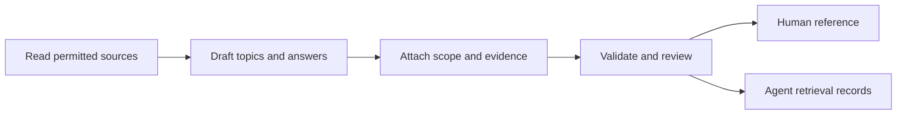

# Documentation people and agents can use

[Documentation skill](skills/aide-ci-documentation/SKILL.md) / [Rendered example](skills/aide-ci-documentation/examples/example-export.md) / [Format contract](skills/aide-ci-documentation/references/FORMAT.md)

Give your agent this instruction:

> Use the aide-ci-documentation skill to document this product from the authorized sources. Preserve the CI Source topic and troubleshooting format. Show missing evidence, validate the record and generate the human and machine views. Prepare the change for our usual review and publication process.

## Familiar format, stronger evidence

The document starts with **CI SOURCE**, owner, version and last-reviewed date. It keeps the freshness panel, table of contents, topic/subtopic structure, natural-language troubleshooting questions and cross-product dependencies.

The added contract makes each answer traceable and reusable:

| A reader asks | The record provides |
| --- | --- |
| Does this apply to my system? | Subject version, environment and explicit scope |
| Where did this answer come from? | Source references, revisions, hashes and observations |
| Is it observed or expected? | Observed, reported, planned or unknown evidence states |
| Is it still current? | Scoped comparison, reviewer, due date and freshness state |
| What else can break? | Dependency contracts, impact, fallback and owner |
| What replaced the old behavior? | Stable IDs, lifecycle and replacement links |
| What is still unanswered? | Gaps and next actions |

## One authored record, two views

The agent maintains a structured JSON record containing readable prose. The included Python tool validates it and generates Markdown for people and JSONL for retrieval. Both views are derived from the same source and carry its digest. Humans can request edits in ordinary language; the agent updates the record and regenerates the views.

The [synthetic example](skills/aide-ci-documentation/examples/example-export.md) documents a tiny configuration fixture. Its source hash can be checked locally. It deliberately does not claim production behavior or executed QA.

## What this delivers today

This package contains the skill, schema, template, generator, local source-hash checking, drift detection and regression tests. It works on local files independently of a Git provider. Publication uses your existing Git workflow. Read [installation and commands](skills/aide-ci-documentation/SKILL.md#run-the-generator).

It does not install a runtime skill automatically, fetch every source, continuously monitor code, enforce repository permissions or operate a search service. A successful validation checks structure and record consistency; a reviewer still needs to establish that the content is correct. **In Sync is a scoped evidence claim, not a badge the generator awards.**

No format is permanently future-proof. Versioned schemas, plain text, preserved provenance, explicit uncertainty and tested migrations let the documentation evolve without depending on one model or vendor.

Originated at Alpha Health AI. Adapt the templates and review policy to your organization.
