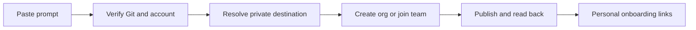

# Start in Claude Code

For a request to connect as an employee with a repository URL, follow [Employee start](EMPLOYEE-START.md). Treat it as an action request, check authentication/access before cloning, and do not ask the person to choose a documentation task or a credential architecture.

[Connection check](GIT-FIRST.md) / [Team structure](TEAM-STRUCTURE.md) / [Two-machine test](TWO-MACHINE-PILOT.md)

At the Claude Code desktop starting screen, keep **Local** selected. If it shows **No folder**, use that control to choose or create an empty working folder, such as `AIDE Setup`. This is a local folder, not a Claude Chat Project. Folder selection is a host step that the repository cannot perform before the session starts. If the client accepts a task without it, the agent checks actual filesystem access and asks for the folder only when needed.

Paste the prompt below. This flow uses local files and Git. It does not require Claude Desktop Projects, synced project knowledge, a browser form or GitHub MCP.

```text
Start AIDE onboarding using https://github.com/Alpha-Health-AI-Inc/aide-framework.
First read GIT-FIRST.md from that repository, or its existing local copy.
Check actual Git tools and my provider authentication before building files.
Reuse a working approved Git/CLI connection; MCP is optional.
Ask only for missing repository owner/name, organization and setup scope.
Create the minimum usable workspace and return its private repo and JOIN.md
links first. Do not wait for a full roster, product assignments or meetings.
If login or a tool is missing, help me complete that step first.
Retrieve the framework once into a separate folder, preserving existing work.
Continue the relevant runbook after the connection check. Use my answers
as the onboarding brief; do not require Projects or launch a browser form.
Do not invent assignments or team policies. Verify the private publication
before preparing personal onboarding links. Give me one next action at a time.
```

If a local copy already exists, tell Claude its folder. For an employee or manager joining a deployment, supply the organization's private repository and personal/team onboarding link instead. They use the bundled Git-first procedure; they do not recreate the organization from public upstream.

## Fewest questions to the first shareable link

Reuse every fact already supplied. Infer technical details only from actual tools and account evidence. Ask once for essential missing facts: the organization/workspace name, exact destination owner and whether this is a new foundation or an existing team. Do not ask a user to repeat a role they already stated. If several accounts or organizations are plausible, require a destination choice rather than silently selecting one.

Default the proposal to private visibility, manual operation, a minimal Four Ps structure, preserved local work and pending unknown content. Account authentication and any still-required creation approval are separate human actions, not organization questionnaires. Managers can add the roster and personal assignments after publication.

First milestone: remote-read verified private repository plus its `JOIN.md` link. The link is a generic entry point, not a grant or personal identity. State whether employee access still needs to be arranged. Prepare personal handoffs once membership is confirmed. Independent employee acceptance remains pending and does not prevent returning the published link.

## What happens next



Only essential facts block the connection: the intended account/host, destination and setup scope. The agent does not need the full roster, product assignments or meeting calendar to check authentication. If the manager lacks assignment details, each employee supplies them during their own onboarding.

The repository includes a concise `CLAUDE.md` entry point. Private workspaces receive their own entry point that reads the deployment's startup and current role rather than initializing a new organization. Instructions are guidance, not enforced permissions. An existing `CLAUDE.md` is preserved and reconciled instead of overwritten.

For multiple teams, use separate working folders or isolated worktrees and the explicit context binding described in [team structure](TEAM-STRUCTURE.md). A human can administer the knowledgebase while reporting to a manager in a team. Folder names and machine ownership do not determine that role.

## Verification status

This route addresses a reported onboarding attempt that claimed authentication before discovering the connector was absent. It also removes the mandatory browser launch and redundant organization questions. The actual signed-in Claude Code journey and independent employee handoff still require the two-machine test.

Checked against official [Claude Code desktop setup](https://code.claude.com/docs/en/desktop), [quickstart](https://code.claude.com/docs/en/quickstart) and [CLAUDE.md guidance](https://code.claude.com/docs/en/memory), September 26, 2026. Runtime capabilities and organization restrictions still determine which actions are available.
