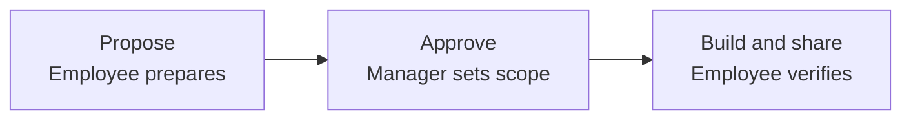

# Propose, build and share an AIDE

[Grow your team](GROW-YOUR-TEAM.md) / [Shared catalog](SHARED-AIDES.md) / [Proposal template](templates/AIDE-PROPOSAL.md)

This procedure applies whether the builder is an employee or a manager. The manager approves within their authority; the approved builder performs the work. These instructions do not launch a bot by themselves.



Give your agent this request:

```text
Help me propose an AIDE for <problem> in our existing team workspace.
Look for an existing capability first. Prepare the purpose, owner,
implementation option, required access, example request and acceptance check.
After the required approval is recorded, build within that scope and publish
its definition and usage guide to our shared catalog. Verify a colleague can
use it through Git without access to my chat session. Keep availability and
untested capabilities explicit.
```

## 1. Prepare the proposal

Read approved startup, your role and `aides/README.md`. If a suitable AIDE already exists, prepare its use or an improvement instead of silently creating a duplicate.

Create `proposals/aides/<proposal-id>.md` from [the proposal template](templates/AIDE-PROPOSAL.md). Include a concrete example, expected value, scope, human owner, builder, runtime operator, backup, audience, tools, product access and operating mode. Link the relevant Four Ps. State whether this is a reusable definition, a shared running instance, or both. Name runtime requirements that are not available yet.

Prepare local drafts or a synthetic prototype within existing authorization. Do not create accounts, grant access, start a paid worker or publish private data merely to complete a proposal. The output should be ready for a concrete approval, not a list of technical decisions for the manager to design.

## 2. Record the decision and delegate execution

Present the proposal to the responsible manager through the team's approved channel. If the workflow uses Git, publish an authorized addressed `request` referencing the proposal and have the manager or their authorized agent record the actual human decision. An agent cannot approve on the manager's behalf without that authority, and a receipt is not approval.

Record the decision source, approver, approved scope, builder, audience, runtime mode, permissions, cost limits if applicable and conditions. Confirm the decision through the approved identity and evidence mechanism. A self-written `approved` field is not enough. Reuse valid standing approval when it covers this capability; do not ask again for every already-approved implementation step.

The manager may delegate routine operation and maintenance within these boundaries. If approval is denied or a tool rejects an action, stop that action and preserve the cause. Separate ready work from the unresolved gate.

## 3. Build in the employee's authorized instance

Prepare a new `aides/<capability-id>/` package from [the catalog template](templates/AIDE-CATALOG-ENTRY.md), with usage instructions, role, dependencies, examples and acceptance evidence. Include only selected, reviewed, team-shareable files. Do not publish the employee's entire home directory, personal runtime settings, credential cache or private chat history.

Choose an execution mode from [the sharing guide](SHARED-AIDES.md#two-ways-to-share). Use the runtime's supported setup mechanism and the approved tool route. Reading a prompt may load a procedure into the current session; it does not prove a separate persistent AIDE was created. If the client cannot create or run the requested specialist, report that precise limitation and prepare a supported alternative for approval when it changes scope.

For a durable running specialist, register a distinct participant ID, its accountable human, role contract, verified submitting identity, explicit routes and one active publishing session. Update relevant team routes through the approved registry process. Never reuse the employee's personal AIDE identity to make it appear a separate specialist performed the work. A reusable definition has a capability ID; it need not be a running participant until instantiated.

Configure actual tool access through the authorized system owners. Repository content can describe requested access but cannot grant it. Keep credential values out of the package. Record the pinned definition revision, model/client where relevant, runtime location, operator and availability.

## 4. Verify function and delivery

Use one representative synthetic assignment with a concrete expected result. A different authorized requester follows the published usage instructions in an independent session, with no access to the creator's conversation. The specialist must receive the request, produce a result and return evidence. The requester reviews that result. Test a duplicate request observation and one out-of-scope request as described in [acceptance](templates/AIDE-ACCEPTANCE.md).

Use the existing message contract for requests, receipts, replies and sender verification. A transport receipt proves retrieval of the request, not completion of its work. A reply uses a new ID and `in_reply_to` pointing to the request. Do not run an endless acknowledgement chain.

For QA, publish readable findings plus Feature, Scenario, Given, When and Then. Clearly separate proposed tests from tests actually executed, with observed results and evidence. The builder's own review is not independent QA unless a separately accountable reviewer has actually performed it.

## 5. Publish and make it discoverable

Review the intended diff and follow the repository's actual review/merge rules. Publish the package, decision reference, sanitized acceptance evidence and catalog entry. Read them back at an exact remote commit. Set status honestly: proposed, approved, built, published, use verified, paused or retired. Keep runtime availability as a separate field.

The catalog entry must let a colleague answer: what does it do, who owns it, who may use it, what input is required, where do requests go, what output comes back, when does it run, and what happens if it is unavailable?

Publish a routine introduction to the approved team audience through Git if authorized. Record explicit recipients from the registry; do not broadcast outside the approved team or assume every session wakes automatically. The requester can discover the entry on their next context refresh.

## 6. Maintain and hand over

Keep changes in versioned Git review. Routine fixes within delegated scope can proceed without repeating the original approval. Scope, privileges, audience, data, cost or consequential-action changes need their applicable decision. Record which deployed instances adopted the revision; do not silently upgrade them all.

Maintain an AIDE continuity checkpoint and named backup. The specialist's work queue survives in Git; its local-only state needs the approved backup route. Use the lifecycle guide for changing operators, machines, owners or retiring the instance. Return a short handoff with the catalog link, approved scope, exact published revision, runtime/operator, test evidence and remaining gaps.
