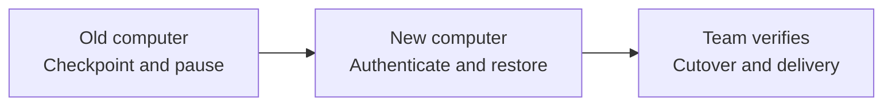

# Change computers or agent clients

[Lifecycle](LIFECYCLE.md) / [Recovery](RECOVERY.md) / [Employee onboarding](ONBOARDING.md)

Managers and employees use the same procedure. Give the new agent your private startup or onboarding link and say:

```text
Resume my existing AIDE on this computer using <private team link>.
Follow the device-change procedure. Preserve my identity, role and history.
Inspect existing local work before changing anything. Reconcile published
messages and receipts before sending. Prepare the move and ask me only for
missing facts, authentication and required approvals. Show what was restored,
what is missing and whether the previous publishing session has stopped.
```



## What travels with you

| Item | Recovery source | What must be checked |
| --- | --- | --- |
| Role, Four Ps and approved processes | Private Git workspace | Current approved revision and stable IDs |
| Published work, messages, receipts and verifications | Exact remote branch and retained history | IDs, source bytes, routes and evidence links |
| Uncommitted files, unpushed commits, ignored files and local attachments | Old computer or approved backup | Explicit inventory and checksums; a clone does not include them |
| Read/reported cursors, pending output and uncertain requests | Approved local-state transfer plus remote reconciliation | Delivery and reporting are separate; missing cursors can cause duplicates |
| Chat history and runtime memory | Optional permitted export or a sanitized checkpoint | They are not automatically in Git; do not import unreviewed chat as authority |
| Skills, extensions and local tooling | Pinned procedure bundle and supported client setup | Read the right references; reinstall or configure only through approved mechanisms |
| Credentials and product sessions | Fresh approved sign-in | Never put secrets in Git or copy a credential cache into the handoff |
| Schedules, hooks and workers | Actual runtime/operator configuration | Stop the old executor and verify any authorized replacement separately |

## 1. Prepare on the old computer

Read the role, current state and pending work. Inventory modified/untracked files, unpushed commits, ignored state and referenced attachments without displaying secret contents. Record which items are published, require a permitted backup, must remain on the old device or cannot be recovered.

Publish only selected team-shareable work after inspecting the diff. Read it back from the configured remote branch. Preserve other approved work through the organization's backup route. Do not push secrets or private material simply to make a move easy.

Update `people/<person-id>/continuity.md` and open a transition record. Include exact remote references, pending delivery/report states, active session, approved version and a next action. Export permitted local recovery state through an approved private transfer route if needed; its directory is ignored by Git. Record backup evidence without embedding private payloads.

Finish or reconcile in-flight writes. Pause the old publishing session and any actual approved triggers through the responsible runtime or operator. Record the observed stop and final remote commit. A note saying “paused” is not proof that a background worker stopped.

## 2. Restore on the new computer

Authenticate using the organization's approved accounts. Confirm the destination, organization, branch, human ID, agent ID and current role against authoritative identity evidence. Inspect an existing local directory before reuse; otherwise create a fresh checkout. Do not overwrite unrelated work, reset a dirty checkout or assume its remote is correct.

Read approved startup, current Four Ps, role, continuity and the transition record. Restore selected unpublished files from the approved backup into a separate location first, compare inventory and checksums, then reconcile conflicts without overwriting either version. Verify large files and attachments separately from text records. Report missing items by name or sanitized reference.

Read the pinned framework procedures and configure the new client's supported startup mechanism, or provide an explicit manual resume prompt. Do not assume another client supports the previous client's extensions, persistent memory, connectors or schedules. Verify Git tools and each needed product connection separately.

## 3. Reconcile before publishing

Freeze the current remote commit and inspect messages, receipts and verifications for this identity. Reconcile each local pending operation with exact remote evidence before any resend. Recover separate last-read and last-reported progress from permitted state or an approved reporting record. If the former human-facing report cannot be confirmed, label that reporting state unknown; do not silently discard it or claim exactly-once reporting.

Confirm the old publisher is stopped and record this session as the active publisher in the transition record. Do not run two publishers for the same identity. If the old computer is inaccessible or may still run, follow [lost-device recovery](RECOVERY.md#lost-or-unavailable-computer) before continuing writes. Read-only recovery can continue within existing access.

## 4. Prove the move

Publish one uniquely identified synthetic test using the existing agent ID. An independent counterpart collects it and writes the exact-content receipt. Verify the receipt and publish the sender verification. Inspect an earlier receipted message once and demonstrate that it does not generate a duplicate receipt or repeated business action.

For a manager move, also prove that pending employee updates and pending decisions are retained and that prior reporting state is either recovered or explicitly unknown. Keep the move pending if the counterpart has not run. A successful clone is only one completed step.

Return:

```text
Identity and role: [verified / blocked]
Published context and work: [restored revision]
Unpublished work and attachments: [verified / missing items]
Delivery/report state: [reconciled / specific unknowns]
Old publisher: [observed stopped / unverified]
New session: [active / read-only / pending cutover]
Product connections and schedules: [verified / remaining gaps]
Independent delivery test: [evidence / awaiting counterpart]
Next action: [owner and action]
```

Keep the old workspace or approved backup until the human accepts the restored result under the organization's retention policy. Do not wipe the old computer as part of this guide.

## Switching models or using two computers

Changing a model or client does not by itself create a new AIDE identity. Use the same approved role and checkpoint, then verify tool access and delivery. A materially different role, owner or attribution mechanism needs a reviewed identity transition.

The manual default is one publishing session per AIDE. Other authorized sessions can read. Before changing the publishing computer, refresh, checkpoint, pause the former session and reconcile. If simultaneous independent work is required, register distinct approved agent identities and routes rather than silently sharing a publisher ID. Git merges alone do not prevent duplicated side effects.
