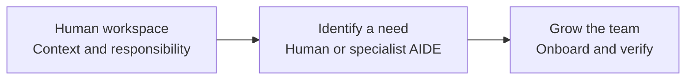

# Grow your workspace and team

[Manager setup](SETUP.md) / [Create an AIDE](CREATE-AIDE.md) / [Use a shared AIDE](SHARED-AIDES.md) / [Lifecycle](LIFECYCLE.md)

Start with the human's workspace. Give that person the context, tools and approved scope needed to work. As responsibilities grow, they can bring in other people and specialist AIDEs. A manager starts the team and sets direction; employees can propose, build and maintain useful AIDEs within approved scope.

## Choose what to add

| Need | Route | Who does the work |
| --- | --- | --- |
| A new human colleague | [Employee onboarding](ONBOARDING.md) on their own machine with their own access | Manager prepares scope and invitation; employee's agent prepares their workspace |
| An existing QA, Product or other specialist | [Use a shared AIDE](SHARED-AIDES.md) | Employee's agent checks the catalog, permissions and request route |
| A new durable specialist | [Create an AIDE](CREATE-AIDE.md) | Employee or manager proposes it; an approved builder implements and tests it |
| A short task needing extra help | A bounded helper in a runtime that supports it | Human's agent delegates only within existing scope; retains responsibility for the result |

The Four Ps remain the business context. An `aides/` catalog describes capabilities used across them; it is not a fifth business silo. Each AIDE links to its accountable People owner, Products, Processes and Projects.

## Employees can initiate

An employee can say, “We keep repeating this QA check. Help me propose an AIDE for it.” Their agent checks for an existing capability, prepares a concrete proposal and, within authorized local scope, a safe prototype. The manager approves the purpose, boundaries, audience, owner and any necessary access or cost. The employee can then build it in their own instance and publish its reusable definition and operating guide into the shared private repository.

The employee remains the builder and may be the maintainer and runtime operator. Those are named responsibilities, not duties that silently fall back to the manager. The manager can approve a reusable scope for routine fixes and operation, so every small improvement does not need another decision. Changed permissions, data scope, costs or consequential actions retain their actual approval requirements.

| Responsibility | Default person to propose | What they own |
| --- | --- | --- |
| Sponsor | Manager responsible for the work | Purpose, scope, priorities and approval of material changes |
| Builder and maintainer | Employee who proposed the capability | Definition, implementation, examples, tests, documentation and fixes |
| Runtime operator | Named capable employee or platform owner | Execution, availability, credentials, stopping and recovery |
| User | Any authorized team member | Appropriate requests, source scope and review of results |
| Backup | Confirmed alternate owner | Continuity when the creator is unavailable |

One person can hold several roles. Do not invent an assignment or authority when preparing the proposal.

## Make it available to the team

The default is a catalog readable by all authorized team members. Everyone can discover the approved capability, see what it does and learn how to use it. Publication alone does not install a bot on their machines or give them its credentials. The catalog must say whether people run their own instance, send requests to a shared instance, or both.

A local shared instance works only when its operator runs it. Requests remain in Git while that computer is asleep. A supported background executor can be introduced separately and tested. Never present a folder, a prompt or a catalog entry as an always-running bot.

## Keep innovation distributed

Publish reusable definitions and examples alongside evidence and a clear owner. Let colleagues suggest improvements through the normal Git review route. Keep active instances pinned to a reviewed version; publishing a new definition does not silently change everyone's running bot. Reuse a working capability when it fits, and allow a separately owned adaptation when the responsibility is genuinely different.

On departure, transfer ownership and pending requests before retiring the creator's access. The team should be able to maintain the shared capability without the creator's private chat history. Use [lifecycle handover](LIFECYCLE.md#role-and-manager-handover) and [device change](DEVICE-CHANGE.md).

The [creation skill](skills/aide-create-specialist/SKILL.md) gives capable agents the corresponding procedure. No shared specialist runtime is included with this documentation kit.
