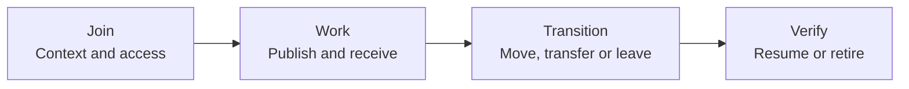

# The AIDE lifecycle

[Manager setup](SETUP.md) / [Change computers](DEVICE-CHANGE.md) / [Recovery](RECOVERY.md) / [Organization rollout](ORG-ROLLOUT.md)

An AIDE belongs to an accountable person and a defined role. Its durable work lives in the team's approved Git workspace. A computer, model or chat session is a replaceable place to run it. The repository cannot recover work that was never published or backed up.

## Choose the situation

| Situation | What the human says | Agent procedure and completion evidence |
| --- | --- | --- |
| New team | “Set up our workspace.” | [Setup](SETUP.md): publish approved context, then verify an independent employee handoff. |
| New employee | “Onboard me using this link.” | [Onboarding](ONBOARDING.md): verify role, local workspace, Git access, product access and delivery separately. |
| New chat or context reset | “Resume my AIDE.” | Read approved startup, role, latest checkpoint and remote exchange state. Keep unresolved work pending. |
| Normal work | “Publish my work” or “Check team updates.” | [Daily use](DAILY-USE.md): deliberate publication, exact-content receipts and separate reporting progress. |
| New computer or another agent client | “Move my AIDE here.” | [Device change](DEVICE-CHANGE.md): checkpoint, authenticate afresh, reconcile history, transfer the active session and verify delivery. |
| Two computers | “Use this computer today.” | Select one publishing session for the same identity; reconcile and stop the previous publisher before switching. |
| Lost computer, offline host or failed write | “Recover my AIDE.” | [Recovery](RECOVERY.md): inventory what is recoverable, resolve uncertain effects and test the resumed path. |
| Role, team or manager change | “Prepare this handover.” | Transfer work and routing with explicit owners and dated evidence; preserve historical identities and receipts. |
| Time away | “Pause my AIDE.” | Publish a checkpoint, record coverage and pause any actual triggers through their operator. Resume with current context and access checks. |
| Employee departure | “Prepare offboarding.” | Transfer work, revoke actual access through authorized owners and preserve records under the organization's retention policy. |
| Framework, schema or provider change | “Prepare this upgrade.” | Review the pinned version and proposed diff; test in isolation before changing the live deployment. |
| Organization retirement | “Close this workspace.” | Resolve or assign pending work, stop workers, remove access and retain or dispose of records under approved policy. |

These are instruction-led procedures. A status file does not stop a running agent, revoke credentials or enforce a lock.

## Durable continuity

Create `people/<person-id>/continuity.md` from the [checkpoint template](templates/CONTINUITY.md). Keep current scope, source revisions, in-progress work, last verified publication, pending messages and the next action there. Include manager checkpoints as well as employee checkpoints: the manager must preserve reporting progress and pending decisions across machines.

Create a dated `operations/transitions/<transition-id>.md` using the [transition template](templates/TRANSITION.md) for a device move, role transfer, recovery, upgrade or retirement. Store sanitized evidence and approvals, never credentials or raw private chats. Keep historic transition records; update the current checkpoint to reference the latest one.

The human ID identifies the person. The agent ID identifies their approved AIDE role. A session label identifies one execution context and is not an identity credential. Keep the same human and agent IDs when the owner and role remain the same. A new person or distinct role receives a new approved identity; never relabel old messages as if the replacement authored them.

The transition record names the active publishing session and cutover commit. This is an operational convention for the manual pilot. Strong concurrent-writer enforcement requires a verified coordination service or provider control; this kit does not supply one.

## Role and manager handover

1. Read current role, membership, product access, project ownership and pending exchanges. Prepare the concrete old/new owner and routing diff from confirmed facts.
2. Obtain any required authority for changed role, access and publication scope. Keep the human's employment decisions outside routine team-readable records.
3. Publish the departing role's checkpoint with unfinished work, requested decisions and evidence. The successor reads it and records acceptance or specific gaps in the transition record.
4. Update current role links, ownership and routing version at an explicit effective commit. Keep old identities and historical routes available for interpreting earlier records.
5. Inventory messages awaiting the old manager. Do not silently treat them as addressed to the new manager or fabricate an old manager's receipt. An authorized participant can publish a new forwarding message to the successor, referencing the original without changing it. Keep original delivery status distinct from forwarded delivery.
6. Grant or remove real repository and product permissions through their actual owners. A changed People entry is not an access change. Verify the new route through independent message, receipt and sender verification.

## Pause and offboard

For a planned absence, set coverage, pending work and the next check in the checkpoint. Stop only the actual schedules or workers covered by the request. On return, refresh approved context, inspect receipts and outstanding effects, confirm current scope and resume without resending successful requests.

For departure, prepare one reviewable handover containing work owners, pending messages, product-access removals, repository access, devices, sessions and actual worker schedules. Authorized administrators perform revocation. Verify the former identity can no longer perform the applicable reads/writes without re-enabling access to test it. If verification is unavailable, record revocation as reported or pending, not proven.

Retire the participant in the deployment's approved registry convention; retain historical identity references and receipts. Do not delete their work folder to simulate revocation. Revoking remote access cannot erase existing clones or downloaded files. Device cleanup, retention and disposal remain the organization's separate managed process. Do not publish personnel reasons in shared records.

## Upgrade and retirement

Pin the framework revision and record profile used by the deployment. Review upstream changes before adopting them. Test the proposed upgrade against synthetic messages, existing receipts, local recovery state and old checkpoints in an isolated copy. Preserve the previous version and a recovery plan. Never overwrite an established exchange schema by copying fresh templates over it.

A provider or repository move must inventory branches, work artifacts, attachments, large-file storage and permitted evidence links. Verify copied bytes and readable references. Retain original message IDs and original evidence commits; record explicit mappings if storage locations change. Freeze publication during the agreed cutover, test the destination route, then update approved startup and handoff links. Missing evidence remains a migration gap.

Retirement requires a named owner for every outstanding item, stopped triggers, verified access removals, an approved retained archive and tested retrieval where retention is required. Destructive disposal follows explicit organizational authorization. Closing a repository does not establish that every external integration or local copy is gone.

## Release gates

The [lifecycle acceptance matrix](SETUP-ACCEPTANCE.md#lifecycle-acceptance) defines the evidence required for these transitions. The framework publishes procedures and templates; it does not yet claim tested lifecycle automation or organization-wide deployment readiness.
