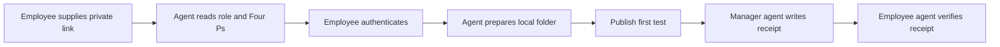

# Employee onboarding

[Manager setup](SETUP.md) / [Daily use](DAILY-USE.md) / [Acceptance checks](SETUP-ACCEPTANCE.md)

The manager gives the employee a private `people/<person-id>/ONBOARDING.md` link and arranges repository access. The employee gives that link to their agent:

```text
Onboard me using this team link: <private onboarding link>.
Read the approved startup instructions, prepare my local workspace,
check my role and product access, and complete the first delivery test.
Ask me to authenticate or approve only when needed. Preserve existing work.
```



## Procedure for the employee's agent

1. **Resolve the destination.** Read the handoff, approved `START-HERE.md`, deployment configuration and registry from the exact branch. Verify the assigned human and agent IDs and the manager recipient. If the authenticated identity conflicts, stop that action and report the cause. Do not create a new identity to bypass a mismatch.
2. **Prepare local work.** Choose a new folder or inspect the provided checkout. Confirm its remote and branch, preserve uncommitted work, fetch current approved content, and make the employee's `people/<person-id>/work/` available. Do not reset or overwrite another checkout. The folder becomes shared when selected changes are pushed.
3. **Learn the Four Ps.** Read the assigned People entry, Products, Processes and Projects. Confirm sources and revisions. Summarize the role and current assignment in plain language. Ask for missing work scope rather than inventing tasks.
4. **Check access.** Confirm remote read and permitted publication capability with synthetic content. Separately inspect product access requirements. Use permitted read-only checks where available, and record not checked, requested, granted or verified working. Prepare any missing access request for the named owner. Do not copy credentials into Git.
5. **Publish onboarding evidence.** Save `people/<person-id>/onboarding-status.md` with the observed context revision, assigned IDs, local workspace status, product access gaps and pending decisions. Publish only sanitized evidence. Read it back from the remote branch.
6. **Test delivery.** Generate one unique synthetic token locally, create an addressed test message using [the exchange contract](EXCHANGE-CONTRACT.md), publish it and read it back. Tell the employee that the manager agent must next run “Check team updates.” The token is delivery-test data, never a credential.
7. **Verify the receipt.** On a later authorized check, read the matching manager receipt, validate its exact message reference and submitting identity, and publish one sender verification. Preserve all three artifact references. Do not resend a successful test while waiting.
8. **Report readiness.** Mark the employee connected only after identity, startup and permitted Git read/write checks pass. Mark delivery verified only after the three artifacts agree. Product access and human acceptance retain their own states.

## The employee's everyday experience

Work locally with the agent. Say “Publish these findings to my manager” when ready. Later say “Check whether my update arrived.” There is no automatic sharing of private chat history. The default shared folder is team-visible after publication.

If onboarding is interrupted, inspect `operations/setup-state.json`, the person's onboarding status, and existing remote messages and receipts. Resume the first incomplete stage instead of re-creating accounts, folders or successful tests.
