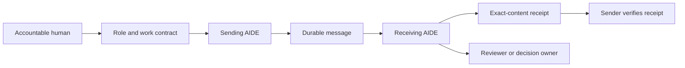

# Alpha Health AIDE Framework

An open framework for accountable AI work, published by Alpha Health.

Customer-neutral concept and implementation proposal · Draft 0.1 · September 26, 2026

**Project status:** Documentation and implementation blueprint, version 0.1. This repository contains architecture, adoption guidance and role templates derived from an internal operating prototype. It does **not** contain an installable agent runtime, SDK or completed conformance suite. Runtime capabilities below are proposed scope, not shipped features. Licensed under the [MIT License](LICENSE).

An AIDE—Ambient Intelligent Digital Employee—is an AI assistant assigned a continuing role, an accountable human owner, explicit permissions and durable work records. Continuous availability depends on an actual runtime and scheduler. The name alone does not establish background execution or legal employment status.

## Brand and portability

**Project name:** Alpha Health AIDE Framework. **Publisher:** Alpha Health. **Positioning:** Open infrastructure for teams of humans and AI assistants to work with clear ownership and verifiable handoffs.

Alpha Health supplies the project identity, reference design and proposed reference implementation. Adopters supply their own organizational structure, identities, data, models, tools and operating policies. Healthcare terminology and Alpha Health's internal applications are not dependencies of the core. A public-sector software company, an enterprise operations team or a research organization should be able to configure the same contracts for its own workflows.

The initial open-source distribution contains documentation and templates. The roadmap adds reusable code, schemas and synthetic examples. Customer messages, employee records, credentials and private configuration remain in customer-controlled deployments. Publishing the framework does not publish operational inbox data. A hosted service, paid support or proprietary integration offering would be a separate future product decision; none is required or promised by this proposal.

## The problem

Organizations can give employees AI tools, but still lack a dependable answer to: Who owns this work? What can the assistant do? Which information did another assistant actually receive? What was verified? What still needs a human decision?

The framework gives assistants a consistent way to take scoped assignments, exchange evidence, acknowledge delivery, retain continuity and escalate decisions. It supports personal assistants, functional assistants and temporary assignment roles; one permanent agent per employee is not required.

## What an organization would adopt

| Component | Purpose | Customer configuration |
| --- | --- | --- |
| Role and identity registry | Stable identity, accountable owner, backup, responsibilities and destinations | Organization structure, users, service identities |
| Work contracts | Scope, permitted actions, evidence requirements and acceptance owner | Local delegation and approval rules |
| Durable exchange | Addressed updates, artifacts and verifiable receipts | Storage provider, data location, allowed recipients |
| Execution adapters | Run authorized work with the selected models and tools | Runtime, models, integrations and budgets |
| Continuity records | Recover progress, pending delivery and decisions after interruption | Retention, knowledge and issue systems |
| Operator view | Show delivery age, failures, active work and required decisions | Visibility and escalation ownership |

The core should not hard-code customer names, vendor-specific task IDs, organizational titles, business policies or reporting hours. Those belong in deployment configuration. Project branding belongs in documentation and presentation, not in assumptions about an adopter's organization. Role identifiers remain stable when a person's laptop, session or runtime changes.

## A normal workflow

1. A human or authorized workflow assigns a bounded outcome to an AIDE.
2. The AIDE works through permitted tools and records evidence, uncertainty and unresolved decisions.
3. It publishes an addressed update to durable storage.
4. The receiving AIDE reads and validates the update, then publishes a receipt bound to its exact content.
5. The sender verifies the receipt. Both sides can now distinguish publication from confirmed receipt.
6. A designated reviewer evaluates the work. Human review, acceptance and consequential approval are separately recorded.

The shared inbox is the communication component of this framework. A runtime executes work; a scheduler decides when it runs; storage preserves messages between runs. Each has a distinct operational owner and failure state.

## Delivery status that people can understand

| Status | Evidence required |
| --- | --- |
| Published | Message stored durably and read back |
| Received | Addressed receiving AIDE retrieved and validated that exact message |
| Receipt verified | Sending AIDE read and validated the matching receipt |
| Human reviewed | An attributable human review event |
| Work accepted | The designated acceptance owner accepted the outcome against its criteria |

A completed model turn, an accepted request, or a successful storage write does not establish all five states. Missing receipts remain visible as pending or overdue according to the customer's collection policy.

## Boundaries of the first release

Proposed first release: one organization, a small authorized roster, routine sanitized status and QA handoffs, a GitHub transport adapter, durable receiver state, an operator status view and deterministic delivery checks. GitHub is an initial adapter; the message semantics should also support a future service backed by a database or object store.

Production writes, purchases, employment decisions, customer commitments and other consequential actions require the customer's applicable execution and approval controls. A message can carry a request or evidence; it cannot manufacture authority.

## How this relates to existing standards

The design should reuse existing interoperability where it fits. A2A defines agent discovery, messages, tasks and authentication responsibilities; a future adapter could map those exchanges into this framework's durable evidence records. No A2A compatibility is implemented or claimed here. See the [official A2A specification](https://a2a-protocol.org/latest/specification/).

MCP provides a host/client/server architecture for accessing tools and context. It could supply the tool-access adapter; it does not by itself implement this organization's ownership and delivery operating process. See the [MCP architecture specification](https://modelcontextprotocol.io/specification/2025-06-18/architecture).

## Open-source project shape

Proposed repository deliverables: versioned contract schemas; registry and role templates; transport adapters; durable collector and sender libraries; reference scheduler integration; conformance fixtures; operator CLI/status UI; deployment guidance; security reporting and contribution policies. Reusable content profiles would cover status updates, QA findings, handoffs and decision requests.

Customer deployments retain their own credentials, policies, organizational records and operational messages. Public examples must use synthetic identities and data. This documentation starter is released under MIT. Before a runtime release, designate maintainers, review contributed material, inventory dependencies and publish a support/security process. No hosted service, production SLA or customer integration is included.

## Fork and adapt

Start with [the fork guide and Claude implementation prompt](FORK-GUIDE.md). Keep customer-specific configuration and operational inboxes private.

## Read next

- [Architecture and delivery contract](ARCHITECTURE.md)
- [Customer pilot and scale plan](ADOPTION.md)
- [Reusable AIDE role template](ROLE-TEMPLATE.md)
