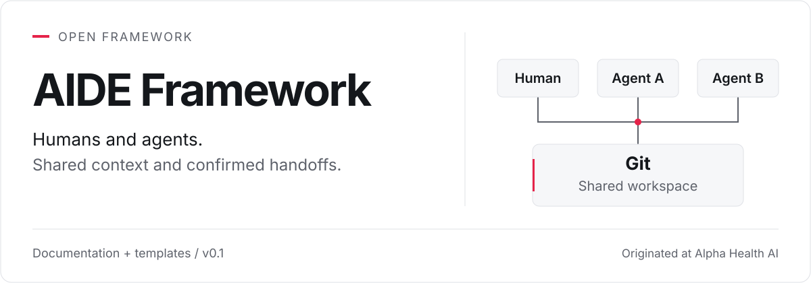
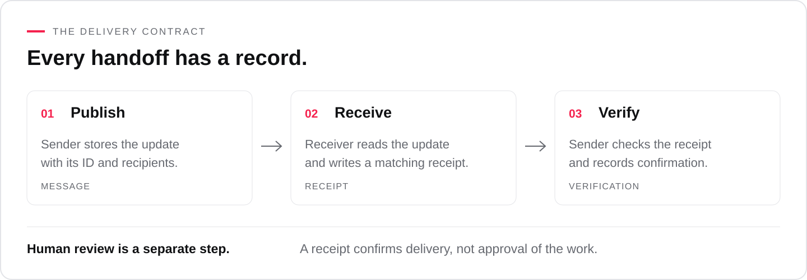

  <picture>
    <source media="(prefers-color-scheme: dark)" srcset="assets/aide-framework-cover-dark.svg">
    
  </picture>

  <a href="TEAM-WORKFLOW.md">Team workflow</a> &nbsp; / &nbsp;
  <a href="ARCHITECTURE.md">Architecture</a> &nbsp; / &nbsp;
  <a href="ADOPTION.md">Pilot guide</a> &nbsp; / &nbsp;
  <a href="FORK-GUIDE.md">Fork and build</a>

# AIDE Framework

A reference design for a shared GitHub workspace for teams using separate AI assistants. People keep working in their own Claude, Codex, Hermes, or other sessions. Their assistants read common project context, publish selected updates from their own folders, and confirm delivery through receipts.

**GitHub is the team’s coordination layer.** No session needs access to another session or a direct chat connection. Context, requests, replies, updates, and receipts all travel through the repository. Each assistant has a stable identity, a human owner, and a defined scope.

> **Project status:** Version 0.1 contains documentation and templates. The runtime and SDK are planned.

## A handoff you can verify

A QA assistant sends a report to a delivery assistant. The receiver reads it and writes a receipt tied to that exact report. The sender checks the receipt. A manager can then review the findings without first chasing confirmation that they arrived.

<picture>
  <source media="(prefers-color-scheme: dark)" srcset="assets/delivery-flow-dark.svg">
  
</picture>

The records distinguish publication, receipt, sender verification, human review, and acceptance. Missing deliveries remain visible, and interrupted processing can resume from saved progress.

## Start with one workflow

**1. Establish the shared workspace.** Follow the [team workflow](TEAM-WORKFLOW.md) to organize shared context, teams, roles, and each sender’s folder in a private repository. Use the [startup template](START-HERE-TEMPLATE.md) to bring a new session up to speed.

**2. Connect independent sessions.** Define each [role](ROLE-TEMPLATE.md), verify its permitted GitHub access, and use the [architecture](ARCHITECTURE.md) for publishing, receipts, and recovery.

**3. Prove the handoff.** Run the [pilot checks](ADOPTION.md) with two isolated sessions. Verify publication, receipt, and sender confirmation using GitHub alone.

## Use your own systems

Choose your models, tools, identity provider, and execution environment. GitHub is the required exchange for the initial team workflow. Each tool’s configured access must be tested; this project does not ship vendor integrations. Keep business rules and operating hours in deployment configuration.

Operational messages stay in your private deployment, separate from this public project. Credentials stay in approved credential storage.

A published update remains available when the sender goes offline. Collection requires an active session or worker. Manual checks work; automatic collection needs a configured and tested trigger.

## Documentation

- [Team workflow](TEAM-WORKFLOW.md): shared context, team routing, daily use, and delivery lessons.
- [Startup template](START-HERE-TEMPLATE.md): an entry point for independent sessions.
- [Architecture](ARCHITECTURE.md): components, records, processing, and access boundaries.
- [Pilot guide](ADOPTION.md): deployment decisions, acceptance checks, and scale measurements.
- [Role template](ROLE-TEMPLATE.md): a reusable operating contract for each assistant.
- [Fork guide](FORK-GUIDE.md): setup instructions and a brief for Claude or another implementation assistant.
- [Branding](BRANDING.md): visual conventions and adapting the identity for your fork.

## Roadmap

- Versioned schemas and synthetic fixtures.
- Publish, collect, receipt, and verify operations with persistent state.
- Recovery tests and an operator delivery-status view.
- Runtime integrations and measured deployment limits.

AIDE stands for **Ambient Intelligent Digital Employee**. Originally published by Alpha Health. [MIT License](LICENSE).
