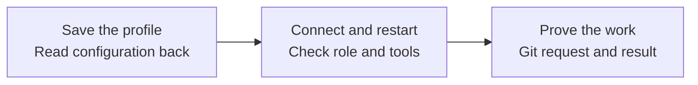

# Connect an AIDE to a real runtime

[Create an AIDE](CREATE-AIDE.md) / [Provider access](PROVIDER-SETUP.md) / [Readiness](READINESS.md)

A saved bot profile is a starting point. Verify its persisted role, actual tools, shared environment, startup behavior and execution mode before presenting it as a working teammate. This guide applies to personal AIDEs and specialist rosters across different agent clients.

## 1. Reconcile existing profiles

Inspect only the authorized account and selected workspace. Compare the approved roster with existing runtime profiles using stable IDs, human owners and role references. Classify each as reuse unchanged, update with an exact diff, create missing, conflict or unavailable. Similar display names do not prove identical participants. Do not create a second bot just because the first session cannot be found.

For a roster setup, show one concise plan with responsibilities, dependencies and proposed execution mode for each role. Retain working profiles and their history. Do not create a full department roster from a template without an actual assignment and approval.

## 2. Save and read back the actual configuration

Use the runtime's supported profile/session setup tool or settings surface. Record the resulting native profile ID, stable AIDE ID, role and definition revision, startup entry, operator and available execution mode. Read the saved values back through the actual settings/API where supported. Compare them with the approved role; a conversational “done” is not a configuration read-back.

If configuration cannot be inspected, mark saved configuration unverified and test behavior separately. Do not treat behavior as proof of settings that are not observable. If only the current conversation can hold instructions, label it a manual session, not a persistent configured bot.

Use the [runtime record](templates/RUNTIME-RECORD.md). Add a concrete [runtime recipe](templates/RUNTIME-RECIPE.md) for the actual supported client/version. Keep unknown operations blocked or manual; never invent setup commands to fill the recipe.

## 3. Inspect the real access boundary

Determine whether profiles share an account, filesystem, browser session, credential store or tool permissions. Distinct bot names, prompts and working folders do not establish technical isolation. A template copied to another account may create a new instance rather than access to the original instance. Record which behavior was actually verified.

For a shared-account pilot, document its attribution and isolation limits. If the work requires technical separation, use approved independent accounts or environments and verify permitted and denied access with synthetic fixtures. Do not test isolation by opening private user data. Never share an account login merely to make a bot accessible.

## 4. Check each integration independently

Inventory required Git and product connections. For each, record not configured, authentication needed, configured but untested, verified for a named operation, denied or unavailable. A profile can exist while every integration is missing.

Authenticate through the provider's approved flow. Read one permitted synthetic or low-sensitivity resource to establish the intended identity, organization and scope. Verify a bounded write only when required and authorized. Test Git publication and exact remote read-back independently from product access. If a required tool is absent, name that specific gap and prepare one concrete authentication or installation step through a supported mechanism.

A model's statement that it can browse, code or run in the cloud is capability information to test, not a successful connection test. Use actual tool evidence. Keep secrets out of every record.

## 5. Test a fresh session

After saving, open a fresh session for the same configured profile through the authorized runtime mechanism. Do not feed it the earlier private conversation. Ask it to read its approved Git startup and report its stable identity, role, current context revision, permitted tools and pending work. Verify these against the registry and role.

If startup is manual, supply only the documented startup link and label that requirement. Test the supported restart or resume behavior without destroying active work. Record missing persistence explicitly; server-side conversation history alone does not prove startup instructions are applied in a new session.

## 6. Verify execution and wake-up separately

| Claim | Minimum evidence |
| --- | --- |
| Runs when asked | One authorized synthetic task completes with independently read output. |
| Executes on a hosted environment | An attributable execution record identifies the environment and output; app self-description alone is insufficient. |
| Collects without an open chat | An approved real trigger runs while the chat is inactive, with timestamped publication and receipt. |
| Works without the user's computer | After an agreed device-unavailable boundary, a separate authorized source publishes a fresh unique request; a still-running independent observer verifies its result before the device returns. |
| Has an affordable operating mode | Current provider/account billing evidence and measured usage, with named limits and operator. A trial or usage counter alone is insufficient. |

Keep these states separate. Do not turn off a person's machine, disconnect access or start schedules merely to satisfy a check; prepare the bounded test and use actual authorization. A calculation queued before a laptop goes offline does not establish that new work can be received afterward. If the observer also goes offline or the timeline cannot be verified, retain the limitation.

Record tool calls, elapsed time and available usage/cost evidence for the bounded probe. If monetary cost is unknown, say unknown. Approve any hosted worker, recurring trigger or spend separately where required. A documented budget is not an enforced limit unless the runtime actually enforces it.

## 7. Verify the roster through Git

Use explicit participant IDs and small authorized synthetic test batches. Record any native group-size or tool limits observed for this client/version; do not turn one vendor's limit into a framework rule. Native chat acknowledgements are optional diagnostic evidence, not proof of the Git exchange.

For each required recipient, verify its own message retrieval and exact-content receipt. Keep unavailable recipients pending and distinguish a coordinator's acknowledgement from everyone's delivery. A helper ping or manual activation must be separately labeled; it cannot be counted as proof of automatic wake-up. Do not resend delivered requests while work is pending.

Run one useful request/result test after transport passes. Receiving a message and being competent to complete it are distinct checks. Use [specialist acceptance](templates/AIDE-ACCEPTANCE.md) for independent requester review.

## Report only the completed gates

Return the roster with native profile and stable IDs, saved configuration, fresh-session result, Git access, product connections, shared-environment limits, execution mode, trigger status and usage limits. Each gate gets an observed date, evidence, exact error or next owner/action. Use verified, reported, not tested, blocked or not applicable with a reason. No single “active” label can replace this report.
