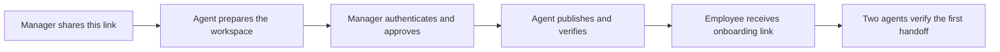

# Set up your team

[Overview](README.md) / [Employee onboarding](ONBOARDING.md) / [Daily use](DAILY-USE.md)

Give your agent the link below. It prepares the workspace and explains what needs your approval. You authenticate with your Git provider and approve the proposed scope. You do not need to design a folder structure or write operating instructions.

```text
Set up our team's AIDE workspace using
https://github.com/Alpha-Health-AI-Inc/aide-framework/blob/main/SETUP.md
Follow the agent setup runbook. Prepare sensible defaults and the actual
files before asking me to approve publication or access changes.
Ask me only for missing organization facts, authentication, and decisions
that require my authority. Verify each completed step and tell me what
is still pending. Do not call setup complete until the stated checks pass.
```

> This is an agent-led documentation and skill kit, not an installer. It requires an agent with permitted filesystem and Git tools or equivalent repository APIs. The complete two-person experience has not yet been independently validated on a customer deployment. No authentication, access or automation is created by opening this link.



## What you will be asked to do

| Your part | What the agent prepares |
| --- | --- |
| Confirm the organization and pilot team | A short setup proposal with the destination, owners and defaults filled in |
| Authenticate | The supported provider sign-in or credential-manager flow, without asking for secrets in chat |
| Approve publication and access when needed | Exact repository visibility, files, people, permissions and purpose |
| Confirm the first employee and their role | Their People entry, agent identity, product-access checklist and onboarding link |
| Accept the pilot result | Links to the published test message, receipt, sender verification and remaining gaps |

If the agent cannot infer a necessary fact, it asks one compact question. It should not invent your organization, employees, policies or product assignments.

## Recommended starting point

| Setting | Default proposal |
| --- | --- |
| Provider | Your existing approved Git provider; ask only if the destination is ambiguous |
| Workspace | A new private repository named `aide-workspace`, subject to availability and approval |
| Readers | Named pilot team members; everything committed is visible to all authorized team readers |
| Structure | People, Products, Processes and Projects, plus organization context and exchange records |
| Branch | One explicitly recorded exchange branch; propose `main` for a new dedicated workspace and honor existing branch policy |
| Participants | Manager and one employee, each with their own human and agent identity |
| Operation | Local working folders, deliberate publication and manual collection on request |
| Product access | Existing approved accounts; track requirements and verification separately from repository access |
| Infrastructure | No new paid service, background worker or schedule by default |
| Data | Synthetic delivery tests first; team-shareable work only after scope approval |

Read the [agent runbook](AGENT-SETUP.md) for the execution procedure. Start there automatically when the manager supplies this page. Use [templates](templates/README.md) to prepare the files and [skills](SKILLS.md) to load only the relevant procedure.

## What completion means

**Workspace prepared:** local files exist and have been reviewed. **Workspace published:** approved files are readable at the exact remote branch. **Employee connected:** the employee's independent session has read the workspace and verified its permitted access. **First handoff verified:** message, receiver receipt and sender verification all agree. **Pilot accepted:** the responsible human reviews the evidence.

The agent reports these states separately. A missing employee response remains pending; it is not a reason to repeat a delivered request or claim the employee is onboarded.
