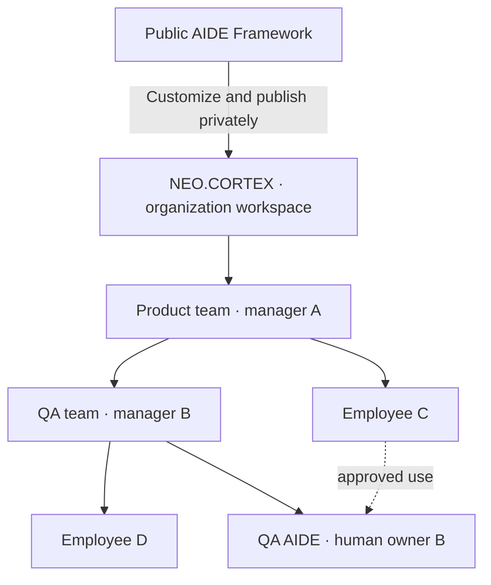

# One organization, many teams

[Start onboarding](QUICKSTART.md) / [Two-machine pilot](TWO-MACHINE-PILOT.md) / [Organization rollout](ORG-ROLLOUT.md)

The public framework supplies the starting kit. A manager turns it into an organization-owned private workspace, such as NEO.CORTEX. Employees receive links from that deployment, with their own role and onboarding instructions.

NEO.CORTEX is an adoption example, not a claim that NEOGOV has deployed or approved this configuration.

## People keep their identity; roles have scope

| Item | What it represents |
| --- | --- |
| Organization | Shared identity, operating rules and approved context |
| Workspace | A private repository and its sharing boundary |
| Team | People, assigned AIDEs, work and a responsible owner; may reference a parent team |
| Human | One stable participant within the organization, regardless of computer or number of teams |
| Membership | That person's role and reporting relationship in one team |
| AIDE | A scoped agent identity with a human owner and verified runtime binding |
| Project context | The selected workspace, team, membership, AIDE, branch and recipients in a particular client project |

A manager can be an employee of a parent team. A person can belong to multiple teams without creating duplicate human identities. Different organizations maintain their own identities and authority. A single human playing two roles in a pilot does not prove independent human acceptance.

## Start, join or extend

- **First manager:** customize the public kit, propose a private destination, publish approved content and prepare personal onboarding links.
- **Employee:** join the manager's private repository using their personal onboarding link. Reuse published organization context.
- **Manager of another team:** join the existing organization and prepare a scoped team entry. Reuse common Products, Processes and Projects. Create a separate repository only for an approved sharing boundary or operational requirement.
- **Employee becoming a manager:** retain existing membership and add the approved manager membership. Do not overwrite the parent-team role.
- **Shared specialist:** publish its reusable definition and approved usage route. Configure each actual instance and identity separately. Repository visibility does not make a bot runnable or grant product access.

## Record the relationships

Use the [membership template](templates/TEAM-MEMBERSHIP.json) for each approved team role. Team records may add `parent_team_id` (null for a root team), a stable `workspace_id`, and the membership IDs. Verify referenced teams and humans exist. Reject parent-team cycles and conflicting membership IDs before publication. These are agent-reviewed contracts; this kit does not include an automatic hierarchy validator or policy enforcement service.

Use the [project context template](templates/PROJECT-CONTEXT.json) for each client project. Resolve it from the exact private handoff and registry at startup. Before publishing, show the target team, repository, branch and recipients. If a project contains conflicting bindings, clarify the intended scope before writes. A project title or folder name is not enough to select a destination.

`workspace.json`'s manager recipient is a default for the initial pilot. A team-specific operation uses its explicit membership/context recipient. Do not silently send every team's work to the initial manager or inherit authority from a reporting line.

## Two or more projects on one machine

For example, one person may have:

| Client project | Team role | Working context |
| --- | --- | --- |
| Product · contributor | Employee in Product | Their assignments and Product manager recipient |
| QA · manager | Manager of QA | QA roster, approved specialists and QA team updates |

Use separate local checkout directories or isolated Git worktrees for concurrent writers. Preserve work and reconcile remote changes before publishing. Keep local collection cursors distinct by organization, workspace, team, recipient and runtime. Sharing a laptop, provider account or folder does not provide identity isolation. Record attribution limits explicitly.

The private Git Service is the common record. Projects and agents do not need direct access to each other's conversations. Sync only relevant context into each project, then publish scoped updates and read matching receipts.

## Hierarchy does not create permissions

Default repository readers can read all committed folders and history. A team tree organizes responsibilities, not confidentiality. Parent managers do not automatically gain product or repository access, and nested teams do not automatically receive delegation. Use provider-enforced repository boundaries or another verified access design where required. [Enterprise deployment](ENTERPRISE.md) describes the remaining access-control investigation.
