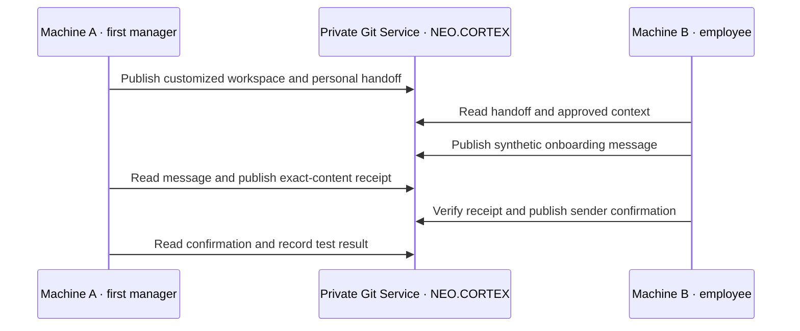

# Test NEO.CORTEX on two machines

[Team structure](TEAM-STRUCTURE.md) / [Claude Projects](CLAUDE-PROJECTS.md) / [Acceptance](SETUP-ACCEPTANCE.md)

This is a proposed acceptance test, not a completed NEOGOV deployment. Use synthetic content until the organization's destination, data and access are approved. The manager owns the resulting private repository. Employee projects use that repository, not the public upstream as their working knowledgebase.

## 1. Machine A: create the first manager workspace

1. Download or clone the public AIDE Framework into an authorized local folder. In Claude Projects, create a project and select the core, manager pack, launcher skill and HTML using the [selection guide](CLAUDE-PROJECTS.md). Knowledge sync and a local clone are separate capabilities.
2. Say **Start onboarding**. The agent reads the launch procedure and opens the exact HTML when supported. Otherwise it supplies the file for you to open. Do not count a proposed URL as a successful launch.
3. Choose **I'm setting up a team**, **New organization workspace**, and the name **NEO.CORTEX**. Supply the actual organization and team facts. Complete the form and return its brief to the agent.
4. The agent renames the starter folder, prepares the Four Ps and the organization-specific entry point. It prepares the exact private repository destination and required actions. You authenticate and approve any actions still requiring approval.
5. Publish the private workspace and verify its remote content. Prepare the employee's People entry, scoped membership, agent identity, personal onboarding link and required invitation. Give the employee the private repo link, exact branch and personal handoff link. Nothing organizational is pushed into the public framework.

## 2. Machine B: join as the employee

1. Create a separate client project using the private repo and personal onboarding link from Machine A. Use the bundled employee context and launcher files. Sync the selected files and confirm the agent can read them.
2. Say **Start onboarding** and choose **I'm joining a team**. Supply the existing workspace, repository, branch, manager and personal link.
3. The agent verifies assigned identity and access, prepares a separate local checkout, reads the relevant Four Ps and publishes sanitized onboarding status. It must not initialize a second organization.
4. Generate a synthetic test token in this employee session, publish its addressed message, and record the remote commit and content reference. Do not supply the token from the manager session.
5. On Machine A say **Check team updates**. It reads the exact message and publishes a matching receipt. On Machine B say **Check whether my update arrived**. It verifies the receipt and publishes one sender confirmation. Machine A reads it back.

## 3. Machine B: add a manager project

Create another client project for the same human's approved team-manager role. Choose **I'm setting up a team** and **Team in an existing workspace**. Provide the existing private repository and branch. The agent reuses the organization and human identity, adds the approved team and membership, and records a separate project context, scoped AIDE and destination recipient. Keep the original employee project intact.

If this team reports to another team, record the parent relationship and actual scoped approval. Add further employees and specialist AIDEs through the same respective onboarding procedures. Do not imply that hierarchy grants access.

## 4. Switch contexts and resume

Publish distinct synthetic updates from the employee and manager projects. Confirm each routes to its own declared recipients and each uses the intended checkout and branch. Restart both sessions and ensure they recover the correct identities and pending states without duplicate publication. A second organization requires an explicitly separate organization binding and approved destination.

## Evidence to retain

| Check | Pass evidence |
| --- | --- |
| Start onboarding | Actual HTML launch or explicit manual file handoff recorded |
| Private publication | Exact remote URL, branch and observed commit |
| Employee joins | Independent session reads the personal handoff and verifies permitted read/write |
| Delivery | Message, matching receiver receipt and sender confirmation |
| Multiple roles | One human identity with distinct scoped memberships and project bindings |
| Routing | Each synthetic update reaches its explicit team recipient |
| Resume | Correct context recovered without duplicate identities or successful writes |
| Human acceptance | Actual responsible human accepts the result and named gaps |

If one person operates both machines, label this a two-session technical pilot. It can test exchange and context separation, but is not independent two-person acceptance. A shared provider credential also limits proof of participant attribution. No new accounts, schedules or credentials should be created merely to hide those limits.

Keep failed checks pending with their exact cause. A synced tile, populated folder or generated skill alone is not a passing deployment.
