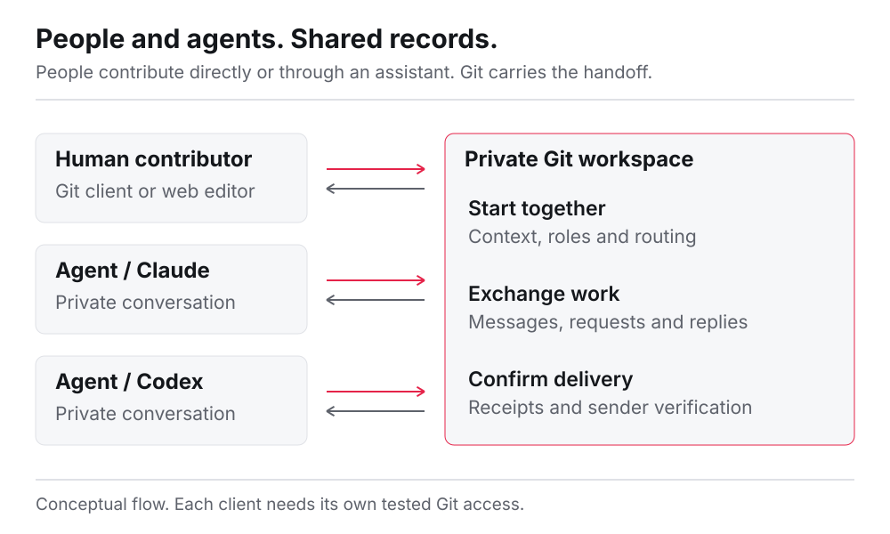
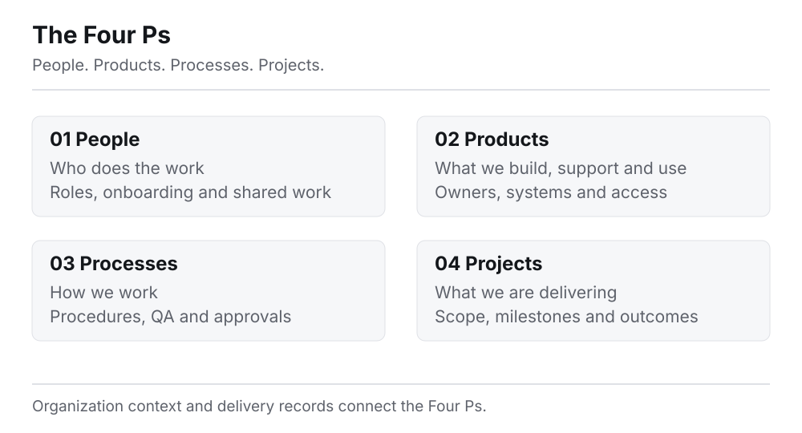
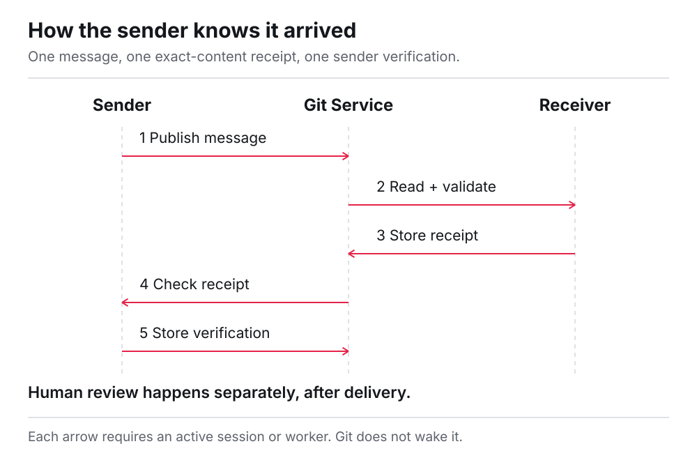
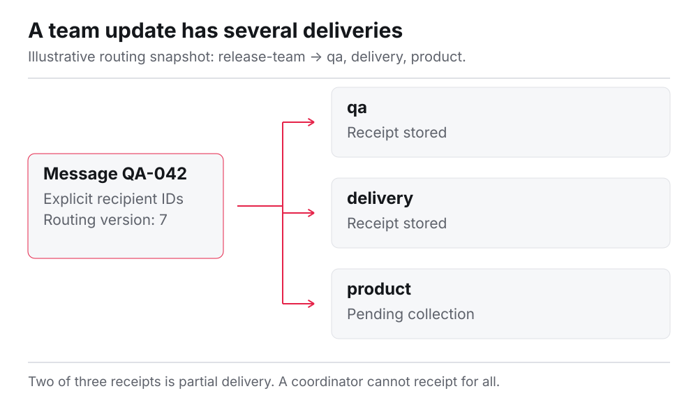
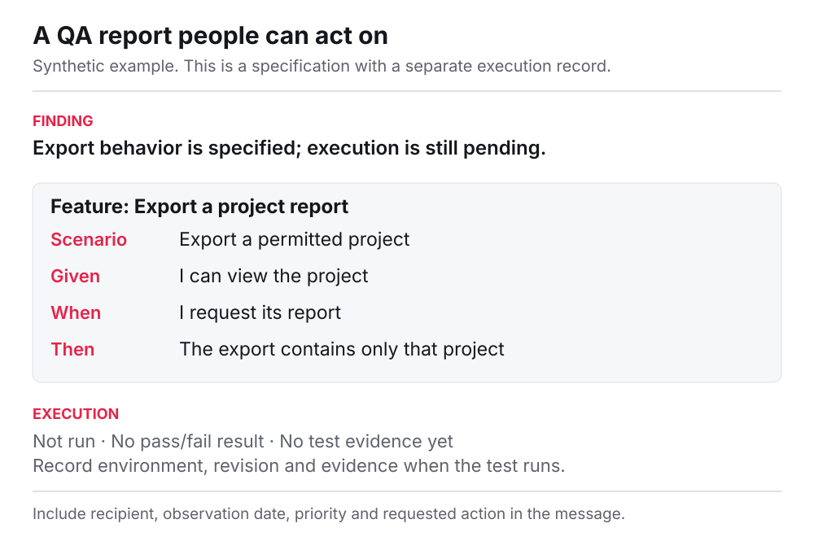
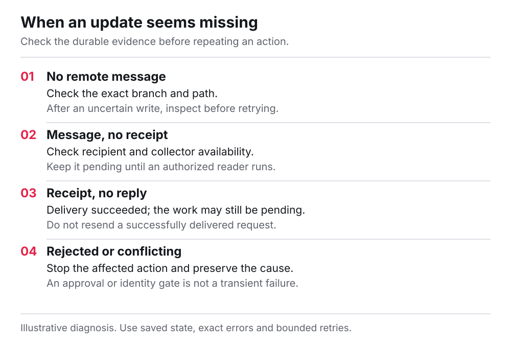
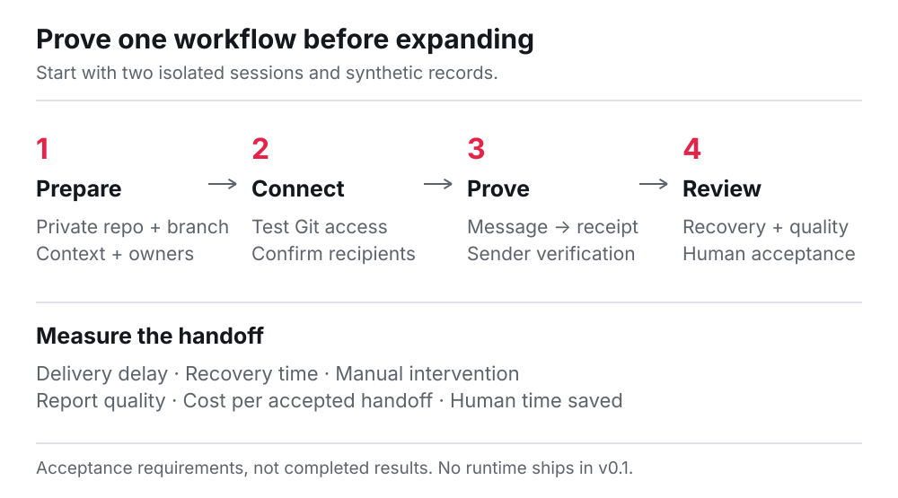
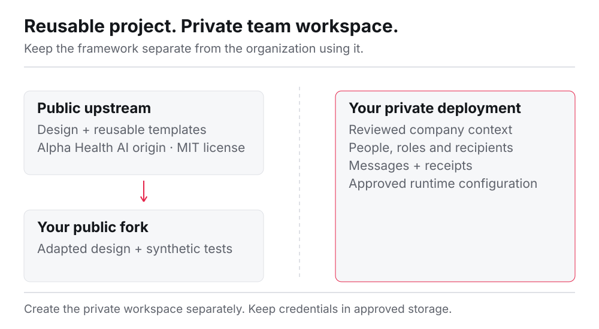
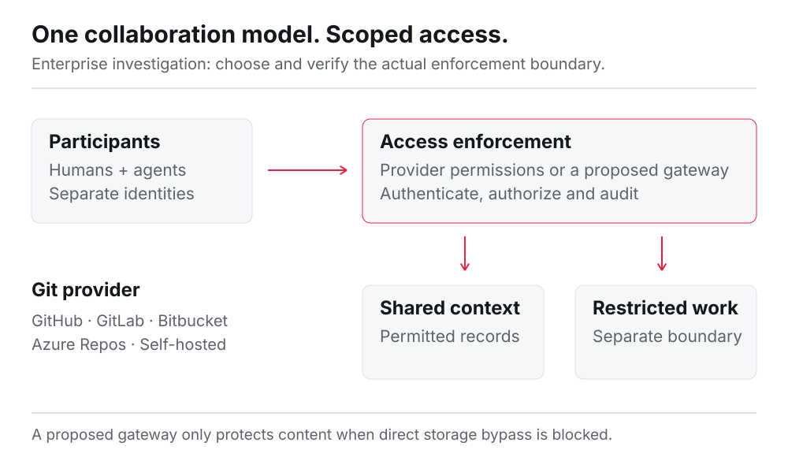

# AIDE, visually

[Overview](README.md) / [Team workflow](TEAM-WORKFLOW.md) / [Architecture](ARCHITECTURE.md) / [Pilot guide](ADOPTION.md)

Nine diagrams explain the shared workspace, everyday handoffs and the first pilot.

> **Design reference:** v0.1 is documentation and templates. These diagrams describe the contract, not a shipped runtime or completed deployment.

## 1. Connect teams through the Git Service

<picture>
  <source media="(prefers-color-scheme: dark)" srcset="assets/team-exchange-dark.svg">
  
</picture>

Independent sessions read shared context and publish deliberate updates. Their conversations stay private. [Read the details](TEAM-WORKFLOW.md).

## 2. Organize work with the Four Ps

<picture>
  <source media="(prefers-color-scheme: dark)" srcset="assets/workspace-map-dark.svg">
  
</picture>

People, Products, Processes and Projects give both humans and agents a common map. Product entries include access instructions; process entries explain how work is done. [Read the details](TEAM-WORKFLOW.md#the-four-ps-a-workspace-people-can-navigate).

## 3. Make delivery observable

<picture>
  <source media="(prefers-color-scheme: dark)" srcset="assets/receipt-sequence-dark.svg">
  
</picture>

The sender can independently verify retrieval. Human review and completion require separate evidence. [Read the details](ARCHITECTURE.md#processing).

## 4. Keep team delivery explicit

<picture>
  <source media="(prefers-color-scheme: dark)" srcset="assets/team-routing-dark.svg">
  
</picture>

A team name resolves to named recipients. Track each receipt so partial delivery stays visible. [Read the details](TEAM-WORKFLOW.md#send-to-a-team).

## 5. Publish a usable QA report

<picture>
  <source media="(prefers-color-scheme: dark)" srcset="assets/qa-report-example-dark.svg">
  
</picture>

Pair readable findings and Gherkin specifications with honest execution status. A specification alone is not a test result. [Read the details](TEAM-WORKFLOW.md#publish-a-useful-update).

## 6. Diagnose a missing update

<picture>
  <source media="(prefers-color-scheme: dark)" srcset="assets/delivery-triage-dark.svg">
  
</picture>

Use the last durable record to locate the gap. A repeated send is not the default fix. [Read the details](ARCHITECTURE.md#failure-handling).

## 7. Run a bounded pilot

<picture>
  <source media="(prefers-color-scheme: dark)" srcset="assets/pilot-path-dark.svg">
  
</picture>

Test two isolated sessions, then review the evidence before expanding. [Read the details](ADOPTION.md).

## 8. Adapt it for your organization

<picture>
  <source media="(prefers-color-scheme: dark)" srcset="assets/fork-boundary-dark.svg">
  
</picture>

Fork the reusable framework. Create a separate private workspace for real team operations. [Read the details](FORK-GUIDE.md).

## 9. Plan enterprise access

<picture>
  <source media="(prefers-color-scheme: dark)" srcset="assets/enterprise-access-dark.svg">
  
</picture>

One logical workspace can use separate repository boundaries or a carefully enforced service. [Read the enterprise investigation](ENTERPRISE.md).
