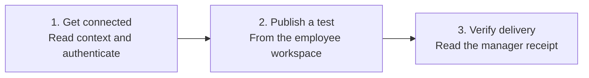

# Employee onboarding context pack

Generated from the canonical runbooks listed below. Sync this pack and CORE.md; do not also select its source runbooks. Linked references are not included automatically. Read or attach a needed reference before executing its procedure.

---

Source: [ONBOARDING.md](../ONBOARDING.md)

# Employee onboarding

[Manager setup](../SETUP.md) / [Daily use](../DAILY-USE.md) / [Acceptance checks](../SETUP-ACCEPTANCE.md)

The manager gives the employee a private `people/<person-id>/ONBOARDING.md` link and arranges repository access. The employee gives that link to their agent:

```text
Onboard me using this team link: <private onboarding link>.
Read the approved startup instructions, prepare my local workspace,
check my role and product access, and complete the first delivery test.
Ask me to authenticate or approve only when needed. Preserve existing work.
```



## Use the visual guide

Open [onboard.html](../onboard.html) and choose **I’m joining a team**. Use the private repository, branch and onboarding link your manager provided. For Claude Projects, select the core and employee context packs using [this guide](../CLAUDE-PROJECTS.md). Knowledge sync alone does not create a local checkout or prove publication access.

## Procedure for the employee's agent

1. **Resolve the destination.** Read the handoff, approved `START-HERE.md`, deployment configuration and registry from the exact branch. Verify the assigned human and agent IDs and the manager recipient. If the authenticated identity conflicts, stop that action and report the cause. Do not create a new identity to bypass a mismatch.
2. **Prepare local work.** Choose a new folder or inspect the provided checkout. Confirm its remote and branch, preserve uncommitted work, fetch current approved content, and make the employee's `people/<person-id>/work/` available. Do not reset or overwrite another checkout. The folder becomes shared when selected changes are pushed.
3. **Learn the Four Ps.** Read the assigned People entry, Products, Processes and Projects. Confirm sources and revisions. Summarize the role and current assignment in plain language. Ask for missing work scope rather than inventing tasks.
4. **Check access.** Confirm remote read and permitted publication capability with synthetic content. Separately inspect product access requirements. Use permitted read-only checks where available, and record not checked, requested, granted or verified working. Prepare any missing access request for the named owner. Do not copy credentials into Git.
5. **Publish onboarding evidence.** Save `people/<person-id>/onboarding-status.md` with the observed context revision, assigned IDs, local workspace status, product access gaps and pending decisions. Publish only sanitized evidence. Read it back from the remote branch.
6. **Test delivery.** Generate one unique synthetic token locally, create an addressed test message using [the exchange contract](../EXCHANGE-CONTRACT.md), publish it and read it back. Tell the employee that the manager agent must next run “Check team updates.” The token is delivery-test data, never a credential.
7. **Verify the receipt.** On a later authorized check, read the matching manager receipt, validate its exact message reference and submitting identity, and publish one sender verification. Preserve all three artifact references. Do not resend a successful test while waiting.
8. **Report readiness.** Mark the employee connected only after identity, startup and permitted Git read/write checks pass. Mark delivery verified only after the three artifacts agree. Product access and human acceptance retain their own states.

## The employee's everyday experience

Work locally with the agent. Say “Publish these findings to my manager” when ready. Later say “Check whether my update arrived.” There is no automatic sharing of private chat history. The default shared folder is team-visible after publication.

If onboarding is interrupted, inspect `operations/setup-state.json`, the person's onboarding status, and existing remote messages and receipts. Resume the first incomplete stage instead of re-creating accounts, folders or successful tests.

## Keep your AIDE when the session or computer changes

Create your shared continuity checkpoint from [this template](../templates/CONTINUITY.md) after onboarding. Record your stable identity, current assignment, source revisions and pending work. Update it at meaningful handoffs and before leaving a session with unfinished work. Keep private chat and credentials out of it.

A new session reads the checkpoint and reconciles remote records. For a new computer or agent client, use [device change](../DEVICE-CHANGE.md). A fresh clone restores published work; unpublished files, local reporting state and attachments need their own verified recovery path. [The lifecycle guide](../LIFECYCLE.md) also covers role changes and departures.

## Discover and create capabilities

Read your team's `aides/README.md` during onboarding. Your agent can explain existing QA, Product or other specialists, their approved use and their availability. Follow [shared AIDEs](../SHARED-AIDES.md) to use one.

If a useful capability is missing, ask your agent to [prepare a proposal](../CREATE-AIDE.md). After the manager's required approval, you can build it in your authorized instance, publish the reusable package and verify it with a colleague. You may own its maintenance; the manager does not need to operate it for you.

Before marking your AIDE connected, use [runtime setup](../RUNTIME-SETUP.md) to read back saved settings where supported and verify startup in a fresh session. Existing profile names do not prove access, persistence or isolation. Keep manual startup and missing product connections visible.

## Multiple teams and roles

Follow [team structure](../TEAM-STRUCTURE.md) for nested managers and people who participate in several teams. Onboarding applies to the selected organization, workspace and team, not to an entire machine. Reuse the person's verified identity within an organization and create a separate scoped membership for each team. A manager of an existing team joins its private deployment; they do not bootstrap another organization. Use the [two-machine pilot](../TWO-MACHINE-PILOT.md) to verify these routes.

---

Source: [EXCHANGE-CONTRACT.md](../EXCHANGE-CONTRACT.md)

# Manual pilot record contract

This profile makes the documented manual setup concrete. It is a versioned record convention, not a shipped validator or secure transport. Automated implementations must enforce these rules deterministically and pass the pilot tests. Apply this profile only to a new pilot or an explicitly reviewed migration; do not rewrite an existing inbox schema.

## Configuration and identity

Use `record_profile: aide-manual-v1` in `workspace.json`. Use lower-case participant IDs containing letters, digits and hyphens, and unique UUID-based message IDs. Use UTC ISO 8601 timestamps. Paths are relative to the workspace root, without traversal segments or absolute paths.

Registry entries distinguish human author, submitting agent and authenticated provider identity. Confirm submission using the deployment's approved authenticated provider evidence or verified signature mapping. A JSON field or plain Git author string is a claim, not proof. Keep identity checks pending if the environment cannot provide the required evidence.

## Message

Store at `messages/<sender-id>/<message-id>.json`. Example values below are illustrative and must be rendered to the actual pilot; generate IDs and observation times during execution.

```json
{
  "schema_version": 1,
  "record_profile": "aide-manual-v1",
  "organization_id": "example-org",
  "message_id": "550e8400-e29b-41d4-a716-446655440000",
  "sender_id": "employee-agent",
  "author_id": "employee-human",
  "submitted_by": "employee-agent",
  "recipients": ["manager-agent"],
  "routing_version": 1,
  "type": "update",
  "created_at": "2026-01-01T12:00:00Z",
  "observed_at": "2026-01-01T11:55:00Z",
  "priority": "normal",
  "work_reference": "projects/example-project/README.md",
  "in_reply_to": null,
  "payload": {
    "summary": "Draft ready for review",
    "status": "work-in-progress",
    "requested_action": "Review the linked draft"
  },
  "evidence": [
    {"path": "people/employee/work/draft.md", "commit": "<immutable work commit>"}
  ]
}
```

Commit and publish referenced work before creating the message so its evidence can name an existing immutable commit. Permitted types are `update`, `request`, `reply`, `qa-report`, and `synthetic-test`. A synthetic test uses `author_id` for its actual author and adds a `test_token` generated by the sender. A reply uses a new message ID and references its original message. Never copy this sample ID into a live message.

## Receipt and sender verification

After actually reading and validating an addressed message, write `receipts/<receiver-id>/<sender-id>/<message-id>.json`:

```json
{
  "schema_version": 1,
  "record_profile": "aide-manual-v1",
  "organization_id": "example-org",
  "receipt_id": "<new UUID>",
  "message_id": "<original message ID>",
  "sender_id": "employee-agent",
  "receiver_id": "manager-agent",
  "submitted_by": "manager-agent",
  "message_path": "messages/employee-agent/<message-id>.json",
  "message_commit": "<frozen observed commit>",
  "content_digest_algorithm": "sha256",
  "content_digest": "<SHA-256 of the exact stored UTF-8 bytes>",
  "received_at": "<actual UTC time>",
  "status": "received"
}
```

For a synthetic message include its independently read `test_token`. Read the receipt back. On the sender's next check, validate identity, organization, message ID, recipient, frozen content and digest; write `verifications/<sender-id>/<receiver-id>/<message-id>.json` with `schema_version`, `record_profile`, `organization_id`, `message_id`, `sender_id`, `receiver_id`, `submitted_by`, `receipt_path`, `receipt_commit`, `receipt_digest_algorithm: sha256`, `receipt_digest`, and `verified_at`. Bind the digest to the stored receipt bytes, not a reserialized JSON object.

Do not issue receipts for receipts or verifications. Human review or acceptance is a separate dated decision record naming the actual human and their expressed decision.

## Validation and recovery

Before processing, check the schema/profile, organization, path/ID agreement, required fields, known sender and author, verified submitting identity, permitted route, explicit recipients, timestamps and source references. A timestamp beyond the deployment's allowed clock tolerance is a conflict to investigate. Hash exact retrieved bytes; a Git blob hash is not the SHA-256 of raw file bytes. If exact bytes cannot be retrieved, do not fabricate a digest or issue an exact-content receipt.

Freeze a remote commit for each bounded collection pass. Process unseen addressed messages regardless of calendar date. Record the snapshot and observation time. Keep local outbox state before each attempt and separate receiver `last_read`, `receipt_pending`, `report_pending`, and `last_reported` progress. The persisted state belongs in an ignored local state directory; published setup evidence contains only sanitized summaries and artifact references.

Existing matching receipt content suppresses a new logical receipt. A same-ID/different-content record is a conflict; never overwrite it. After uncertain writes, inspect the exact destination before one retry. Retry only transient failures, bounded by the deployment's configured policy. Stop permission, identity and content conflicts. Never force-push or reset shared history as recovery.

A crash after publication resumes by inspecting remote records. A crash after reading resumes from pending receipt/report state. A crash after reporting may require reconciliation with the output channel before repeating a report. Manual operation does not promise exactly-once business effects or exactly-once human notifications.
