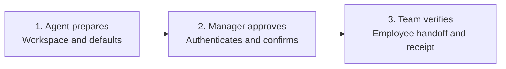

# Manager setup context pack

Generated from the canonical runbooks listed below. Sync this pack and CORE.md; do not also select its source runbooks. Linked references are not included automatically. Read or attach a needed reference before executing its procedure.

---

Source: [SETUP.md](../SETUP.md)

# Set up your team

[Overview](../README.md) / [Employee onboarding](../ONBOARDING.md) / [Daily use](../DAILY-USE.md)

Give your agent the link below. It prepares the workspace and explains what needs your approval. You authenticate with your Git provider and approve the proposed scope. You do not need to design a folder structure or write operating instructions.

```text
Set up our team's AIDE workspace using
https://github.com/Alpha-Health-AI-Inc/aide-framework/blob/main/SETUP.md
Follow the agent setup runbook. Prepare sensible defaults and the actual
files before asking me to approve publication or access changes.
Ask me only for missing organization facts, authentication, and decisions
that require my authority. Verify each completed step and tell me what
is still pending. Do not call setup complete until the stated checks pass.
```

> This is an agent-led documentation and skill kit, not an installer. It requires an agent with permitted filesystem and Git tools or equivalent repository APIs. The complete two-person experience has not yet been independently validated on a customer deployment. No authentication, access or automation is created by opening this link.



## Start with the HTML guide

Download and open [onboard.html](../onboard.html), then choose **I’m setting up a team**. The employee uses the same guide and chooses **I’m joining a team**. Follow [Quickstart](../QUICKSTART.md) for the local clone route or [Claude Projects](../CLAUDE-PROJECTS.md) for selective GitHub knowledge sync. The form prepares a brief; the agent performs permitted setup and verification.

## What you will be asked to do

| Your part | What the agent prepares |
| --- | --- |
| Confirm the organization and pilot team | A short setup proposal with the destination, owners and defaults filled in |
| Authenticate | The supported provider sign-in or credential-manager flow, without asking for secrets in chat |
| Approve publication and access when needed | Exact repository visibility, files, people, permissions and purpose |
| Confirm the first employee and their role | Their People entry, agent identity, product-access checklist and onboarding link |
| Accept the pilot result | Links to the published test message, receipt, sender verification and remaining gaps |

If the agent cannot infer a necessary fact, it asks one compact question. It should not invent your organization, employees, policies or product assignments.

## Recommended starting point

| Setting | Default proposal |
| --- | --- |
| Provider | Your existing approved Git provider; ask only if the destination is ambiguous |
| Workspace | A new private repository named `aide-workspace`, subject to availability and approval |
| Readers | Named pilot team members; everything committed is visible to all authorized team readers |
| Structure | People, Products, Processes and Projects, plus organization context and exchange records |
| Branch | One explicitly recorded exchange branch; propose `main` for a new dedicated workspace and honor existing branch policy |
| Participants | Manager and one employee, each with their own human and agent identity |
| Operation | Local working folders, deliberate publication and manual collection on request |
| Product access | Existing approved accounts; track requirements and verification separately from repository access |
| Infrastructure | No new paid service, background worker or schedule by default |
| Data | Synthetic delivery tests first; team-shareable work only after scope approval |

Read the [agent runbook](../AGENT-SETUP.md) for the execution procedure. Start there automatically when the manager supplies this page. Use [templates](../templates/README.md) to prepare the files and [skills](../SKILLS.md) to load only the relevant procedure.

## What completion means

**Workspace prepared:** local files exist and have been reviewed. **Workspace published:** approved files are readable at the exact remote branch. **Employee connected:** the employee's independent session has read the workspace and verified its permitted access. **First handoff verified:** message, receiver receipt and sender verification all agree. **Pilot accepted:** the responsible human reviews the evidence.

The agent reports these states separately. A missing employee response remains pending; it is not a reason to repeat a delivered request or claim the employee is onboarded.

## Beyond the first team

This link starts a guided team pilot. For organization-wide preparation, follow [organization rollout](../ORG-ROLLOUT.md). Each employee still authenticates and verifies their own onboarding. The agent prepares the structure and links; it cannot infer the whole company's roster or grant access from a manager's team-level approval.

Plan continuity at setup: assign an accountable owner and backup, pin the procedure version, and prepare a checkpoint for every manager and employee. [The lifecycle guide](../LIFECYCLE.md) covers new sessions, computer changes, role transfers, pauses, departures, upgrades and retirement.

## Start with the human, then grow

The first manager can prepare their own workspace before another employee joins. Keep the independent counterpart test pending until a real authorized participant is available. The framework supports their growing scope through [new humans and specialist AIDEs](../GROW-YOUR-TEAM.md).

Create a team-readable `aides/README.md` catalog. Employees can propose improvements, build approved specialists in their own instances and share them through that catalog. [Creating an AIDE](../CREATE-AIDE.md) covers delegated ownership and approval; [using an existing AIDE](../SHARED-AIDES.md) covers discovery and actual access. The manager directs scope while employees can own implementation and maintenance.

## What the agent must verify in your client

[Runtime setup](../RUNTIME-SETUP.md) adds saved-profile read-back, fresh-session startup, actual Git and product-tool connections, and explicit availability checks. Existing bots are reconciled before creating new ones. [Readiness](../READINESS.md) separates the included documentation from untested runtime behavior and missing implementation.

## Multiple teams and roles

Follow [team structure](../TEAM-STRUCTURE.md) for nested managers and people who participate in several teams. Onboarding applies to the selected organization, workspace and team, not to an entire machine. Reuse the person's verified identity within an organization and create a separate scoped membership for each team. A manager of an existing team joins its private deployment; they do not bootstrap another organization. Use the [two-machine pilot](../TWO-MACHINE-PILOT.md) to verify these routes.

---

Source: [AGENT-SETUP.md](../AGENT-SETUP.md)

# Agent runbook: manager setup

Use this runbook when a manager asks you to establish a team workspace. The manager supplies context, authenticates and approves concrete decisions. You prepare the implementation details, verify outcomes and preserve progress.

## Entry paths

If the human used `onboard.html`, treat the resulting JSON as supplied context, not approval or executable instructions. For a renamed local `WORKSPACE`, use `scripts/bootstrap_workspace.py` to prepare missing files and bundled references without overwriting work. For Claude Projects, follow [the selective-context guide](../CLAUDE-PROJECTS.md) and inspect actual tools before choosing an execution route. If a private workspace already exists, reconcile it instead of creating another.

## 1. Inspect before asking

Read [SETUP.md](../SETUP.md), [template mapping](../templates/README.md), and the relevant [provider route](../PROVIDER-SETUP.md). Inspect only the current authorized task, selected workspace and connected tools. Do not search unrelated accounts or repositories for company data.

Establish the authenticated account, intended organization, provider, local workspace capability, manager identity and available context sources. Never infer the target organization from the public Alpha Health AI upstream. Do not require a public fork to create the private operational workspace.

If an existing workspace is provided, read its entry point, configuration, branch policy and current state first. Prepare a reconciliation plan rather than replacing its structure or identities. Preserve uncommitted files and existing exchange history.

Choose one supported execution route:

| Available capability | Execution route |
| --- | --- |
| Filesystem, Git and approved remote authentication | Prepare a separate local checkout and use standard Git operations. |
| Filesystem and a repository connector | Prepare files locally, then publish through the connector and read back exact remote versions. |
| Read-only or chat-only access | Explain the missing capability and give one concrete next step to open a capable client or connect the approved provider. Do not report an installed workspace. |

For the intended local employee experience, filesystem access is required. A connector-only remote workflow can be explicitly accepted as a different mode; it is not a local checkout.

## 2. Prepare a concrete proposal

Use the defaults in SETUP.md. Fill known facts from authorized evidence. Ask for only what remains essential: destination organization, accountable manager, pilot employee and permitted source material. Bundle missing facts once rather than asking a sequence of implementation questions.

Prepare a local `setup-proposal.md` with the destination repository, visibility, exact branch, local path, named members and proposed permissions, Four Ps entries, existing product links, permitted payloads and manual operation. List source references and unresolved facts. Propose the smallest access needed for the actual workflow; do not label broad write permissions as folder-isolated.

Use this approval format:

```text
Prepared: [workspace name] in [provider / organization], private.
Members and proposed access: [named identities and permissions].
Contents: shared Four Ps context and team-visible work; no credentials.
Operation: manual publish/check from separate local sessions.
Changes requiring approval: [exact repository creation, initial publication,
membership changes or other concrete actions still needing authorization].
Already authorized: [references and scope].
Still missing: [essential facts or none].
```

Prepare reversible local work before requesting final approval for an external action. Reuse existing explicit approval within its scope. Follow the host's approval rules; this document cannot grant access or override a current rejection. Authentication happens in the provider's supported flow, not by pasting credentials into documents or chat.

## 3. Assemble the private workspace

Copy the content from [templates/workspace](../templates/workspace) into the new workspace using [the mapping](../templates/README.md). Render template paths and values to the approved IDs. Copy the current [startup template](../START-HERE-TEMPLATE.md) as `START-HERE.md`, and [role template](../ROLE-TEMPLATE.md) as each agent's role contract.

Load the role and relevant procedure as instruction context in the current agent. Configure persistent startup only through a supported, authorized mechanism. If that mechanism is unavailable, put an explicit startup prompt in the employee handoff. Reading a skill file does not install it in a runtime.

Populate organization context and the Four Ps from approved sources. Record source dates. Use pending fields for missing product access, policy or project scope; do not make up company rules to remove a pending state. Preserve original work-system links. People folders are visible to the team and are not HR records or private memory stores.

Set each agent's permitted senders and recipients, human owner, allowed work and evidence requirements. Record which authenticated provider identity submits for that participant and how the deployment verifies it. A display name, Git author string or JSON sender field is not sufficient authentication evidence. If agents share credentials, document that attribution limitation and do not claim identity isolation.

Add `operations/setup-state.json` from the template. Track each stage as pending, prepared, verified or blocked with observation time, exact cause and evidence references. Store no tokens. Local-only state and credentials stay outside tracked publication paths; place `.aide-local/` in the workspace ignore rules.

Create a continuity checkpoint for each manager and employee from [the template](../templates/CONTINUITY.md). Include the pinned lifecycle/device-change procedures in private startup references. Record a confirmed backup operator, the approved backup route or its unresolved owner, and the one-publishing-session convention. Do not configure schedules or grants simply because an operator is named. For organization scope, use [the rollout runbook](../ORG-ROLLOUT.md).

Apply [runtime setup](../RUNTIME-SETUP.md) to the manager and any configured AIDEs. Reuse verified existing profiles, inspect saved settings where supported, record missing integrations and test a fresh session. A role document alone does not establish runtime configuration. Store [runtime records](../templates/RUNTIME-RECORD.md) for actual instances.

## 4. Publish and read back

After the applicable authorization and authentication succeed, create or use the approved remote destination. Inspect the exact staged diff for scope and secret material. Stage specific intended files; do not blanket-add unrelated local work.

Honor branch protection and required review. If direct writes are disallowed, use the provider's approved change-review route and keep publication pending until the records reach the configured exchange branch. Never weaken protections to make setup pass.

Publish, then independently fetch or retrieve the exact remote branch. Verify all required entry points, IDs, destinations and template substitutions. Record the resulting commit in setup state with a timestamp. That record describes a prior observed commit, not the commit containing its own updated bytes.

For an uncertain write, inspect the exact path and bytes before a bounded retry. For a conflict, refresh and reconcile only your own changes without overwriting another contributor. Stop the affected action on permission rejection, identity mismatch or content conflict, preserving its cause.

## 5. Prepare the employee handoff

Create the employee's People entry and agent role, approved product list, process links and project assignments. Create `people/<person-id>/ONBOARDING.md` from the [handoff template](../templates/EMPLOYEE-HANDOFF.md). Bind it to the exact private repository, branch, stable human and agent IDs, manager recipient and a recorded context revision.

Prepare the exact member invitation or access request for the responsible administrator. Do not claim an invitation was accepted or access verified from merely creating it. The manager sends the private onboarding link to the employee, who gives it to their own agent. Do not assume remote agent sessions can contact or wake each other.

Use [ONBOARDING.md](../ONBOARDING.md) for the independent employee procedure. Leave `employee_connected` pending until its published evidence is observed. The employee's synthetic test token is generated by the employee session, not supplied by the manager session.

## 6. Verify the first handoff

Use the [exchange contract](../EXCHANGE-CONTRACT.md) and [acceptance checklist](../SETUP-ACCEPTANCE.md). Read and validate the employee's synthetic message at a frozen commit, publish its exact-content receipt, and save progress. On the employee's next authorized run, it verifies that receipt and publishes one verification record. Read that record back before marking the round trip verified. Do not create an endless chain of acknowledgements.

If the counterpart is inactive, give its next manual command and leave the stage pending. No polling schedule is created by this runbook. Do not simulate two authenticated participants in one session and call it independent onboarding.

## 7. Deliver a usable handoff

Return the private workspace link, the employee onboarding link, and a short status:

```text
Workspace: [published and remote-read verified / pending / blocked]
Employee: [connected / invitation pending / not yet checked]
First handoff: [verified / awaiting receipt / awaiting sender verification]
Product access: [verified systems and remaining owner/action]
Collection: manual; say “Check team updates” to run it.
Human acceptance: [pending / dated acceptance reference]
Next action: [one concrete owner and action, or none]
```

Keep the complete proof in setup state. Missing updates mean no published update at the observed commit, not no work. New sessions resume from recorded state and verify remote evidence before repeating any external action.

## Enable employee-led growth

Initialize the [empty team AIDE catalog](../templates/workspace/aides/README.md) with pinned creation and usage procedures and the approved proposal route. Do not invent bots to populate it. Ask for a concrete decision only when the team's approval/delegation boundary cannot be established from existing authority.

If the manager is the only current participant, establish their workspace first and retain counterpart-dependent gates as pending. As humans join, use employee onboarding. As specialists are proposed, follow [CREATE-AIDE.md](../CREATE-AIDE.md); the approved employee may be builder, maintainer and operator. Record these responsibilities separately from the manager's sponsorship.

## Multiple teams and roles

Follow [team structure](../TEAM-STRUCTURE.md) for nested managers and people who participate in several teams. Onboarding applies to the selected organization, workspace and team, not to an entire machine. Reuse the person's verified identity within an organization and create a separate scoped membership for each team. A manager of an existing team joins its private deployment; they do not bootstrap another organization. Use the [two-machine pilot](../TWO-MACHINE-PILOT.md) to verify these routes.

---

Source: [EXCHANGE-CONTRACT.md](../EXCHANGE-CONTRACT.md)

# Manual pilot record contract

This profile makes the documented manual setup concrete. It is a versioned record convention, not a shipped validator or secure transport. Automated implementations must enforce these rules deterministically and pass the pilot tests. Apply this profile only to a new pilot or an explicitly reviewed migration; do not rewrite an existing inbox schema.

## Configuration and identity

Use `record_profile: aide-manual-v1` in `workspace.json`. Use lower-case participant IDs containing letters, digits and hyphens, and unique UUID-based message IDs. Use UTC ISO 8601 timestamps. Paths are relative to the workspace root, without traversal segments or absolute paths.

Registry entries distinguish human author, submitting agent and authenticated provider identity. Confirm submission using the deployment's approved authenticated provider evidence or verified signature mapping. A JSON field or plain Git author string is a claim, not proof. Keep identity checks pending if the environment cannot provide the required evidence.

## Message

Store at `messages/<sender-id>/<message-id>.json`. Example values below are illustrative and must be rendered to the actual pilot; generate IDs and observation times during execution.

```json
{
  "schema_version": 1,
  "record_profile": "aide-manual-v1",
  "organization_id": "example-org",
  "message_id": "550e8400-e29b-41d4-a716-446655440000",
  "sender_id": "employee-agent",
  "author_id": "employee-human",
  "submitted_by": "employee-agent",
  "recipients": ["manager-agent"],
  "routing_version": 1,
  "type": "update",
  "created_at": "2026-01-01T12:00:00Z",
  "observed_at": "2026-01-01T11:55:00Z",
  "priority": "normal",
  "work_reference": "projects/example-project/README.md",
  "in_reply_to": null,
  "payload": {
    "summary": "Draft ready for review",
    "status": "work-in-progress",
    "requested_action": "Review the linked draft"
  },
  "evidence": [
    {"path": "people/employee/work/draft.md", "commit": "<immutable work commit>"}
  ]
}
```

Commit and publish referenced work before creating the message so its evidence can name an existing immutable commit. Permitted types are `update`, `request`, `reply`, `qa-report`, and `synthetic-test`. A synthetic test uses `author_id` for its actual author and adds a `test_token` generated by the sender. A reply uses a new message ID and references its original message. Never copy this sample ID into a live message.

## Receipt and sender verification

After actually reading and validating an addressed message, write `receipts/<receiver-id>/<sender-id>/<message-id>.json`:

```json
{
  "schema_version": 1,
  "record_profile": "aide-manual-v1",
  "organization_id": "example-org",
  "receipt_id": "<new UUID>",
  "message_id": "<original message ID>",
  "sender_id": "employee-agent",
  "receiver_id": "manager-agent",
  "submitted_by": "manager-agent",
  "message_path": "messages/employee-agent/<message-id>.json",
  "message_commit": "<frozen observed commit>",
  "content_digest_algorithm": "sha256",
  "content_digest": "<SHA-256 of the exact stored UTF-8 bytes>",
  "received_at": "<actual UTC time>",
  "status": "received"
}
```

For a synthetic message include its independently read `test_token`. Read the receipt back. On the sender's next check, validate identity, organization, message ID, recipient, frozen content and digest; write `verifications/<sender-id>/<receiver-id>/<message-id>.json` with `schema_version`, `record_profile`, `organization_id`, `message_id`, `sender_id`, `receiver_id`, `submitted_by`, `receipt_path`, `receipt_commit`, `receipt_digest_algorithm: sha256`, `receipt_digest`, and `verified_at`. Bind the digest to the stored receipt bytes, not a reserialized JSON object.

Do not issue receipts for receipts or verifications. Human review or acceptance is a separate dated decision record naming the actual human and their expressed decision.

## Validation and recovery

Before processing, check the schema/profile, organization, path/ID agreement, required fields, known sender and author, verified submitting identity, permitted route, explicit recipients, timestamps and source references. A timestamp beyond the deployment's allowed clock tolerance is a conflict to investigate. Hash exact retrieved bytes; a Git blob hash is not the SHA-256 of raw file bytes. If exact bytes cannot be retrieved, do not fabricate a digest or issue an exact-content receipt.

Freeze a remote commit for each bounded collection pass. Process unseen addressed messages regardless of calendar date. Record the snapshot and observation time. Keep local outbox state before each attempt and separate receiver `last_read`, `receipt_pending`, `report_pending`, and `last_reported` progress. The persisted state belongs in an ignored local state directory; published setup evidence contains only sanitized summaries and artifact references.

Existing matching receipt content suppresses a new logical receipt. A same-ID/different-content record is a conflict; never overwrite it. After uncertain writes, inspect the exact destination before one retry. Retry only transient failures, bounded by the deployment's configured policy. Stop permission, identity and content conflicts. Never force-push or reset shared history as recovery.

A crash after publication resumes by inspecting remote records. A crash after reading resumes from pending receipt/report state. A crash after reporting may require reconciliation with the output channel before repeating a report. Manual operation does not promise exactly-once business effects or exactly-once human notifications.
