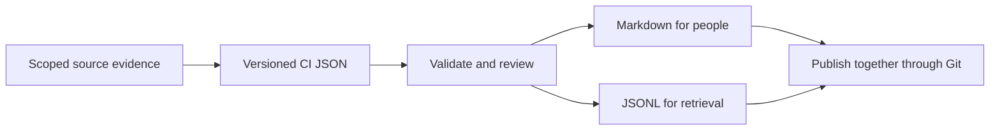

# CI Source v2 format contract

The readable format remains CI SOURCE, owner/version/review metadata, freshness, a table of contents, topics, troubleshooting Q&A and cross-product dependencies. One structured authoring record produces the human document and machine export so they do not drift independently.



## Files and ownership

| File | Purpose | Edit directly? |
| --- | --- | --- |
| `product.ci.json` | Authored facts, prose, sources, scope and review record | Yes, through the team's review process |
| `<doc_id>.md` | Readable reference with stable section anchors | No; regenerate from the record |
| `<doc_id>.jsonl` | Self-contained retrieval records | No; regenerate from the record |

Store product references under the deployment's Products area, process references under Processes, and project-specific references under Projects. Keep People references sanitized for their audience. CI content categories do not replace the workspace's Four Ps. Share the source and both generated files in the same change. The script does not perform a Git commit or an atomic multi-file transaction; `--check` detects incomplete or drifted generated output.

## Required information

The [schema](ci-source.schema.json) is the precise field contract. It uses [JSON Schema Draft 2020-12](https://json-schema.org/draft/2020-12); the supplied validator also checks date formats and relationships between fields.

| Area | What to record |
| --- | --- |
| Identity | Stable document, topic, section, Q&A and source IDs; format version distinct from document version |
| Responsibility | Accountable owner, actual reviewer, established-by attribution and review due date |
| Applicability | Subject version, environment, audience, included and excluded behavior |
| Evidence | Source locator, immutable revision or hash, observation time and claim source references |
| Certainty | Observed, reported, planned or unknown for each section, answer and dependency |
| Lifecycle | Active, deprecated or removed sections, with replacement IDs when available |
| Dependencies | Direction, contract, compatible versions, impact, fallback and owner |
| Gaps | Unanswered question, responsible owner if known, and next action |
| Change history | Dated document versions and concrete changes |

Keep one coherent claim scope per section. If a paragraph mixes reported expectations with observed outcomes, split it. Explain terms, units, limits, defaults, error behavior, permission assumptions and recovery where relevant. Prefer concrete examples over generic assurances. A timestamp or a source URL alone is not proof.

## Freshness has a scope

| State | Meaning |
| --- | --- |
| `unknown` | Evidence has not been compared or cannot be accessed |
| `in_sync` | A recorded comparison supports this document for the stated source snapshot and scope |
| `needs_review` | A change, review expiry or other signal requires rechecking |
| `conflict` | Relevant evidence disagrees and remains unresolved |
| `not_applicable` | Code comparison does not apply; explain why and retain other relevant review evidence |

`in_sync` requires reviewer, reviewed/due dates, comparison time and observed, versioned sources covering all observed claims. The validator rejects expired review, missing references, contradictory comparison timing and code changes after review. It cannot discover an unrecorded code change, authenticate a reviewer, infer truth from a hash or certify production behavior. A claimed revision should be a full immutable Git commit or equivalent immutable version; the string itself is not verified remotely by this tool.

With `--source-root`, hashes are checked against supplied local files, constrained to that directory. Without it, source content is not checked. Neither mode fetches a remote branch or starts an automatic freshness monitor. To maintain live freshness, a deployment still needs an authorized source-change detector, impact mapping, review queue and recorded execution of those checks.

Use UTC timestamps with offsets, ISO dates and explicit versions. `last_code_change` is nullable for non-code material. The template's dates and pending fields are placeholders; replace them with actual facts and do not invent review identities. An expired example may be checked historically with `--as-of`; that does not make it current.

## Human layout

Use a short summary before details, a real table of contents and linked evidence. Include a flow diagram for a multi-step process, a table for comparisons, and screenshots only when the UI matters and sharing is authorized. Give visuals text alternatives. Keep troubleshooting answers actionable: symptom, likely cause, safe checks, expected result, recovery and escalation. Document destructive steps and their prerequisites without treating the reference as permission to run them.

For QA, use Gherkin blocks in section bodies or answers, then record actual execution separately:

```gherkin
Feature: Export limit
  Scenario: Request exceeds the configured maximum
    Given an export limit of 1000 rows
    When a user requests 1001 rows
    Then the request is rejected
```

This is an illustrative expected outcome, not an executed test. A real result needs the environment, tested revision, observation and supporting evidence.

## Migration and compatibility

The v2 label names this public format contract. It does not claim every older internal CI document used one uniform v1 schema. Preserve original documents and stable IDs when migrating; map their metadata explicitly. Carry over Q&A, keyword context and source references without manufacturing missing dates or evidence. Review converted facts before assigning `in_sync`.

Separate document revisions from schema changes. Consumers must reject unsupported schema versions instead of guessing. New optional deployment metadata belongs in `extensions`; any behavioral meaning requires a documented extension contract. Breaking core changes need a new schema version, migration instructions and before/after fixtures. Keep deprecated sections and replacement records available long enough to retire old indexes safely.

## What remains a deployment responsibility

Source discovery, authenticated review, access enforcement, semantic evaluation, search ranking, index deletion, connector compatibility, freshness triggers and deployment acceptance are not implemented by this package. Measure whether retrieval answers representative real questions correctly, cites the applicable version, abstains on gaps and avoids exposing inaccessible content. Format validation alone cannot establish those outcomes.
